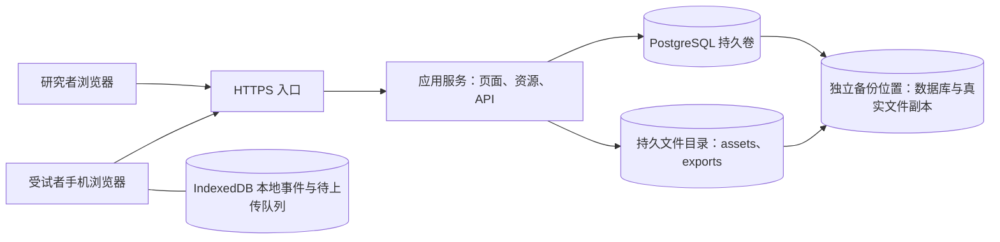

# 浏览器心理实验问卷平台：完整自托管系统设计

> 2026-10-09 用户最新要求已覆盖本文早期的网页问卷编辑、角色区分和服务端完整图片解码设计：管理端只用 JSON 文件和统一密码登录，图片通过 ZIP 原字节上传、服务器仅做容器／标头校验，真实解码在计时前由客户端完成。方向门禁、逐刻度标签及环境协变量见 [JSON 问卷与图片包](JSON问卷与图片包.md)。早期方案留作历史记录。
版本：2.2（数据库与轻量架构修订；正式采集准入待验收）
设计日期：2026-10-07（Asia/Shanghai）  
修订日期：2026-10-08（Asia/Shanghai）  
用途：非商业科研实验；架构、产品、数据与故障处理的实施规范  
本文主体保留 v2.0 设计。2026-10-08 用户确认首版改用 SQLite；[SQLite 实施修订](SQLite实施修订.md)优先覆盖本文所有 PostgreSQL／node-postgres／pg_dump 专属实现。业务数据合同继续适用。当前工程准备见[开发环境与依赖](开发环境与依赖.md)，参考源码核对见[参考代码入口](../references/README.md)；正式业务实现与设备验收尚未完成。

2.2 修订：按用户要求，通过 Gemini_bridge 四轮讨论收敛[轻量化架构与并发稳定性决策](轻量化架构与并发稳定性决策.md)，优先覆盖本文运行架构和性能实现选择。正式业务目标为单 Fastify、单 SQLite 写 worker、有界接收、一次一个重型维护作业；浏览器后台／问卷／Canvas 独立入口。已落实检查页按需加载、公共文件预压缩、日志减量和生产依赖分类；不表示 DB worker、可靠采集或 20 人容量已经完成。第 18 节业务合同及 SQLite 修订的导出／联合备份语义继续适用；原始讨论和实测范围见新决策文档。

1.1 修订：新增 S3 兼容对象存储、资源／导出／备份三类 bucket、对象发布与数据库对账、同源资源网关及独立灾备边界。

1.2 修订：首版为普通问卷＋单图片／底部选择按钮任务；图片通常呈现 100ms 以上，点击不改变固定节奏。单台约 2 核／2–4GB、通常不超过 20 人并发；文件系统实现三个逻辑存储区，S3 后续接入，备份另存独立位置。典型任务几十至一百试次，多数图片 <500KB。采用公开匿名链接；计时组中后台切换、长卡顿或本地保存失败即终止整个会话，只允许补传，禁止同一会话重做。问卷和组间可恢复。内置浏览器纳入支持目标。首版只报告软件时序，物理验证为后续研究准入项。新增被试之间版本／条件顺序平衡的配置与分配合同。

1.3 修订：条件表分别预设图片与空屏时长，组前展开完整时间线；仅图片显示段接受有效响应，无效触摸留日志并忽略。问卷页面提交后锁定，服务端确认前不能推进。支持分组与全任务连续两种模式；统一宽高比、完整显示并留白，竖／横屏布局组前选择后固定到会话。细化迟到输入归属、页面提交凭证、编辑器字段和验收场景。

1.4 修订：研究列表与编辑入口为首页；每项研究独立提供数据质量页。默认以 CSV 数据包导出全部会话状态，附原始事件、字典及质量标志；研究者只查看、导出和标记问题，维护者执行受控修复。首版单个主要研究者，无成员邀请。证实完成凭证与原始记录矛盾时暂停该研究新会话接入，已有会话继续后续页面／组及旧数据补传；未更新会话不自动过期。新增后台状态证据边界、一致导出快照、问题核查及准入恢复合同。

1.5 修订：新增仅针对图片 trial 的自动异常补测。无合法回答／超时、配置标准答案后的错误回答触发；异常触摸后合法答对不补测。每个原始试次默认最多追加 2 次，累计最多出现 3 次；补测仍异常不重置上限。用户选择在当前组未执行队列中随机插入，尽量隔开 3 个其他试次，尾部不足时追加到尾部并记录实际间隔。启用时采用有界动态时间线，替代该组原来的整组固定顺序／终点合同；单次呈现时长与空屏时长仍固定。新增动态许可范围、判定版本、队列事件、迟到纠偏、次数耗尽、导出及专项验收。普通问卷锁定、运行故障终止和分配计数规则继续生效；旧发布协议不自动启用。

2.0 修订：通过 Gemini_bridge 完成多轮契约审查，明确动态队列的本地持久截止点、尾部补测准入、迟到输入观察水位、QUEUED／STAGED／已观测出现三种纠偏边界、不可逆状态和运行许可关闭。按用户确认：已锁定但尚未软件呈现的补测无法安全撤销时，终止整个会话并保留数据。接管原始事件、业务核对及页面／组封存分层；单写者不依赖组内网络心跳；文件发布／维护清理和一致导出均补充崩溃恢复合同。第 18 节为可直接拆分实施任务的逻辑模型、操作契约及准入门，审查过程见同目录《设计收敛_多轮审查记录.md》。设计收敛不表示已实现或已通过采集验收。

## 1. 设计结论与适用范围

首版采用 **TypeScript 单仓库、一个应用服务、一个 PostgreSQL 实例及受控文件存储目录**，同机部署，不运行独立 S3 服务。浏览器端以 SurveyJS Library 渲染普通问卷，轻量自建编辑器维护研究协议；限时图片和试次组由独立的 Canvas 实验模块执行。应用服务采用 Node.js/Fastify，负责页面、资源网关、采集、确认、对账和导出。本地通过 idb 封装 IndexedDB，保存待上传事件。

存储抽象分为 `research-assets`、`research-exports` 和 `research-backups` 三个逻辑 bucket，首版映射为持久目录，并非真实 S3 bucket。保留对象键、摘要、权限与生命周期管理，后续通过适配层迁移 S3。备份副本定期复制到另一台机器／NAS 或经确认隔离有效的独立磁盘。答案、原始试次事件、修订和确认以 PostgreSQL 为唯一业务主记录，文件存储及未来 S3 不参与答案 ACK 事务。

编辑器生成冻结的研究协议，运行端执行该协议，采集核心统一保存所有题型。可靠性不依赖某个题型自己的提交回调，也不依赖问卷最后一次大提交。

时序目标是：在受支持的设备与浏览器中，使图片呈现时长、SOA 和 ISI 的误差及漂移保持在预先定义的范围。接受设备／会话内相对稳定的显示延迟，不承诺所有手机共有一个 offset。软件诊断用于筛选环境，物理时序结论需要外部测量。

### 1.1 已确认需求

| 需求 | 本设计的落实方式 |
| --- | --- |
| 自托管、非商业科研 | 研究协议、图片、答案、试次及备份由研究团队管理；免费组件优先 |
| 只在浏览器运行 | 桌面浏览器编辑，手机浏览器作答；不要求安装 App 或 PWA |
| 问卷系统的强化 | 常规题、分页、分支、预览与发布为主体；增加图片实验题和重复试次组 |
| 图片必须预加载 | 当前连续试次组全部必需资源下载、解码和布局准备通过后才允许开始 |
| 呈现时长与刺激间隔稳定 | 单一呈现区域和调度器；各次呈现的图片／空屏时长固定，响应不提前推进；启用补测时未来队列有界动态变化 |
| 答案、触摸、软件 RT、逐试次日志 | 分开保存答案、原始事件、试次结果和诊断，使用同一会话关联 |
| 不能接受静默缺失 | 明确记录题目／试次状态；服务端逐项确认；完成前检查缺失项 |
| 首版实验范围 | 普通问卷＋固定图片反应时任务；编辑时长、响应区、条件表和随机顺序 |
| 小型单机部署 | 约 2 核／2–4GB，应用与数据库共机，文件系统存储，无独立 S3 进程 |
| 首版并发目标 | 通常不超过 20 人同时作答；集中预加载与组间提交纳入容量验收 |
| 典型刺激与推进 | 图片通常 ≥100ms；触摸不提前结束图片／空屏，异常回答可按协议追加未来试次 |
| 异常终止 | 连续计时组切后台、长卡顿或本地保存失败时终止整个会话；问卷／组间允许离开与恢复 |
| 内置浏览器支持目标 | 尽量直接支持微信等环境；按系统、内核、版本及任务验收，失败有明确诊断与退出路径 |
| 全栈高效精简 | 单应用＋PostgreSQL＋持久文件目录，S3 接入延后；备份副本独立 |
| 图片规模 | 典型任务几十至一百试次，多数图片 <500KB；按像素尺寸与当前组解码预算门控 |
| 匿名分发 | 统一公开链接，限制同一会话重做；接受无法严格识别跨会话重复参与 |
| 首版时序证据 | 软件节奏诊断与日志；物理 offset 未验证，后续补外部测量 |
| 图片与响应模板 | 单张图片＋底部固定两个或多个选择按钮；响应区组前固定 |
| 被试间平衡 | 平衡分配版本或条件顺序；分配结果与实际执行顺序不可变且可审计 |
| 条件时序 | 条件分别预设图片时长与空屏时长，SOA 由两者计算；不同条件总长度可不同 |
| 有效响应窗口 | 仅图片显示段接受首次合法的新触下；无响应记超时，空屏输入不成为答案 |
| 无效触摸 | 提前、持续按住、多点等保留审计并忽略，不直接改变当前阶段或自动终止；是否补测依最终可核对回答判断 |
| 自动异常补测 | 仅图片 trial；无合法回答或答错触发，合法答对后的异常触摸仅留日志；每个原始试次默认最多追加 2 次 |
| 补测位置 | 当前组安全的未执行位置随机插入；尽量隔开 3 个其他试次，尾部不足则取安全尾部并保留实际间隔 |
| 锁定后的迟到纠偏 | 补测已 STAGED 但尚未软件出现，证实不应补测且不能安全撤销时终止整个会话；已出现的记录保留 |
| 问卷页面锁定 | 本页提交确认后不允许返回修改；恢复到服务端确认的进度 |
| 运行模式 | 分组模式可组间停顿；全任务连续模式须事先准备全部资源与计划 |
| 刺激布局 | 固定宽高比、完整显示留白；竖／横屏组前选择，固定到会话并记录实际几何 |
| 后台入口 | 首页为研究列表、发布版本、资源状态及最近修改；数据质量进入研究内查看 |
| 导出默认 | 覆盖全部会话状态，CSV 分表，附原始事件、字典与质量标志，不自动排除样本 |
| 问题处理权限 | 研究者只查看、导出、记录问题类型／备注／核查状态；维护者单独重建与修复 |
| 首版协作 | 单个主要研究者使用，保留账户与权限边界，不做成员邀请流程 |
| 完成数据异常 | 证实原始缺项／确认矛盾时暂停新会话接入；已有会话继续，维护者定位及验收后恢复接入 |
| 静默会话 | 只显示最后接收时间和已确认位置，无自动过期或按静默时长推断丢失 |

用户在 Formbricks 中遇到的具体症状是：后台存在回答记录，但部分题目或试次数据缺失。现有部署版本、原始请求和保存记录尚未获得，因此本设计不判断其根因，也不宣称替代系统已经证明更可靠。

### 1.2 默认边界

首版支持说明页、单选、多选、量表、短文本、条件分页、固定图片呈现、触摸反应和条件表驱动的重复试次，增加受控的异常补测队列。实验编辑采用固定模板：选择图片与响应区，配置时长与顺序；不提供任意阶段拼装、嵌套循环或自适应难度设计器。异常补测是冻结规则内的有限追加，不开放任意脚本式自适应流程。任意自定义脚本、音视频精密同步、后台实验、传感器和外设同步不进入首版。

允许短暂弱网，但连续试次组开始前必须建立会话并确认计划。组内不等待网络；组外等待保存与服务端确认。无法保存或无法对账时暂停，不把继续运行后产生的不完整数据标为完成。

上述“暂停”针对准备、同步等待等尚可恢复的问题。正式计时组一旦出现已确认的终止触发，不再回到可作答状态；保留记录并完成可行的补传与异常对账。普通问卷与组间允许暂时离开并恢复；恢复先核对保存和会话状态，再进入下一安全边界。

## 2. 参考仓库与取材方式

本轮公开仓库及文档调研通过 **Gemini_bridge** 完成。以下功能与许可证信息采用其返回资料，未进行独立联网复核、源码审计或真机测试。具体 release、commit、依赖版本与维护日期尚未锁定；实施时需要固定候选版本并检查其许可证和兼容范围。

表中的“采用”是设计决定，不代表其已经通过本项目验收。“未确认”保留为未决项。尤其不能将数据库封装库等同于可靠同步系统。

| 仓库 | 可借鉴或复用的机制 | 本方案定位 | 许可证与边界 |
| --- | --- | --- | --- |
| [SurveyJS Library](https://github.com/surveyjs/survey-library) | 页面、条件逻辑、题型与自定义组件；[文档](https://surveyjs.io/form-library/documentation/overview) | 采用，负责普通问卷渲染 | Gemini 返回 MIT；实验调度、资源解码、发件箱和端到端对账由本系统承担 |
| [SurveyJS Creator](https://github.com/surveyjs/survey-creator) | 可视化题目树、属性面板、配置预览；[文档](https://surveyjs.io/survey-creator/documentation/overview) | 可选编辑器，不作为免费首版依赖 | 源码公开的商业授权组件；未确认非商业科研自动豁免；参见[授权说明](https://surveyjs.io/licensing) |
| [jsPsych](https://github.com/jspsych/jsPsych) | Timeline、参数化试次、预加载声明；[文档](https://www.jspsych.org/) | 协议参考，复杂范式时可选 | Gemini 返回 MIT；插件调度各异，不能假定全部逐帧或具备可靠持久化 |
| [lab.js](https://github.com/FelixHenninger/lab.js) | 图形化实验节点、呈现和计时设计；[文档](https://lab.js.org/) | 实验编辑与计时机制参考 | Gemini 返回 Apache-2.0；默认是否输出完整逐帧日志未确认 |
| [JATOS](https://github.com/JATOS/JATOS) | 研究组件、会话和被试访问管理；[文档](https://www.jatos.org/) | 研究生命周期参考，不加入默认服务栈 | 本轮许可证未确认；现成提交 API 是否满足本设计的精确确认与对账合同未验证 |
| [Form.io 前端库](https://github.com/formio/formio.js) | 组件树、属性编辑与表单配置；[文档](https://help.form.io/) | 编辑器参考 | 本轮许可证边界未确认；前端、后端和企业组件分别判断 |
| [idb](https://github.com/jakearchibald/idb) | IndexedDB Promise 接口、事务生命周期及事务完成确认；[README](https://github.com/jakearchibald/idb#readme) | 采用，封装浏览器存储 | Gemini 返回 ISC；不自带业务发件箱、重试、幂等或完整性对账 |
| [Fastify](https://github.com/fastify/fastify) | 请求校验、生命周期和 HTTP 服务；[文档](https://fastify.dev/) | 采用，单一应用服务 | Gemini 返回 MIT；事务提交及确认语义由业务层实现 |
| [node-postgres](https://github.com/brianc/node-postgres) | 连接池和事务；[文档](https://node-postgres.com/) | 采用，数据库访问 | Gemini 返回 MIT；事务需要同一个连接；驱动不替代数据库约束和持久化配置 |
| [PostgreSQL](https://github.com/postgres/postgres) | 事务、唯一约束、写前日志和崩溃恢复；[文档](https://www.postgresql.org/docs/) | 采用，唯一业务数据库 | Gemini 返回 PostgreSQL License；单机持久化不等于整机损坏时零数据损失 |
| [Garage 官方项目文档](https://garagehq.deuxfleurs.fr/documentation/) | 自托管 S3 服务及[兼容范围](https://garagehq.deuxfleurs.fr/documentation/reference-manual/s3-compatibility/) | 未来 S3 迁移候选，首版不部署 | Gemini 返回 AGPL-3.0；官方代码源／GitHub 镜像身份及目标版本未锁定，不采用未经确认的镜像作为部署入口 |
| [SeaweedFS](https://github.com/seaweedfs/seaweedfs) | 对象存储与 S3 网关；[架构文档](https://github.com/seaweedfs/seaweedfs/wiki/Architecture) | 未来 S3 替代候选，首版不部署 | Gemini 返回 Apache-2.0；Master／Volume／Filer／S3 角色及所选单机模式需锁定与验收 |
| [MinIO](https://github.com/minio/minio) | S3 自托管实现参考 | 仅参考，不默认引入 | Gemini 返回 AGPL-3.0；当前社区分发、维护与控制台功能范围未确认 |
| [AWS SDK for JavaScript v3](https://github.com/aws/aws-sdk-js-v3) | [S3 客户端](https://docs.aws.amazon.com/AWSJavaScriptSDK/v3/latest/Package/-aws-sdk-client-s3/)与流式对象访问 | 未来 S3 适配器候选，首版不引入 | Gemini 返回 Apache-2.0；需验证与选定自托管实现的实际 API 兼容性 |

### 2.1 仓库使用决定

首版直接依赖 SurveyJS Library、idb、Fastify、node-postgres 和 PostgreSQL，文件读写使用 Node.js 原生能力。首版只实现文件系统后端，不安装 S3 客户端或运行 S3 服务。以后迁移 S3 时优先复用已有兼容服务；新建可先验证 Garage，未通过则评估 SeaweedFS，此顺序不代表完成选型。Canvas 与浏览器帧调度使用原生能力。编辑器先做卡片、属性面板、条件表和上下移动，拖拽仅改善操作，不作为功能正确性的前提。

jsPsych、lab.js、JATOS 和 Form.io 提供参考机制，不同时成为运行依赖。若采用 jsPsych，实验模块内部由它独占执行，逐个确认插件的时间控制与响应结束规则；不再并行运行另一套试次调度器。

### 2.2 实施前的仓库评估记录

每个实际引入的组件记录：固定版本／commit、许可证及附加条款、依赖清单、目标浏览器支持范围、构建产物大小与加载时间、扩展入口、升级兼容策略。体积、速度和稳定性以本项目测量为准，不从仓库名气或“原生实现”推断性能。

## 3. 系统结构与部署拓扑

HTTPS 可复用现有入口；独立部署时使用一个反向代理。正式采集需要 HTTPS，浏览器存储、会话和资源使用稳定的同源地址。数据库只向应用和受控管理网络开放。存储目录不映射成公开目录，经同源授权网关访问。逻辑 bucket 不等于独立进程。应用静态页面可随部署产物托管，冻结运行器包和研究图片保存在 assets 中。

### 3.1 单仓库模块

| 模块 | 职责 |
| --- | --- |
| 研究者界面 | 研究管理、题目编辑、条件表、资源管理、发布检查、预览、数据状态与导出 |
| 受试者界面 | 接入、说明、普通问卷、资源准备、实验运行、组间同步、恢复和结束 |
| 协议模块 | 跨端类型与约束、冻结版本、分支规则、事件定义、完整性规则 |
| 问卷适配层 | 将平台协议映射至 SurveyJS；接收题目变化与导航；不将 SurveyJS 的完成回调当作最终提交成功 |
| 实验运行器 | 固定／有界动态时间线、补测队列、图片切换、输入、回调节奏和中断检测 |
| 本地存储层 | 事件与待上传状态的原子写入、重启恢复、容量与错误处理 |
| 同步层 | 小批次提交、有限重试、精确确认、冲突处理和组间对账 |
| 存储适配层 | 逻辑 bucket 映射、文件访问、校验、资源发布、导出状态和引用对账；保留未来 S3 接口边界 |
| 服务端 | 身份与访问、协议发布、会话、增量采集、数据库事务、完成检查、导出与审计 |

同一应用服务可以承担首版全部服务端职责。通过模块边界控制复杂度；以后只有实际容量或隔离需求成立，才拆分服务。单仓库不要求额外构建编排平台。

### 3.2 前端运行边界

普通问卷页面由问卷引擎管理。进入实验组前，宿主完成输入框失焦、布局准备和状态冻结；实验运行器独占呈现区域与时间线。退出后再更新进度、校验、持久化检查和同步界面。

默认采用同页组件集成。若以后需要 iframe，应单独设计跨上下文消息、时钟和恢复合同，并重新验证；不把它作为首版捷径。Canvas 也不自动保证精度，它只是缩小需要验证的呈现路径。

### 3.3 小型单机的容量与工作预算

本轮确认的部署目标为约 2 核／2–4GB、通常不超过 20 人同时作答。这个数字是设计和压测目标，尚不是已经证明的支持容量。测试使用拟定图片总量、连续组长度和事件字段规模，同时覆盖 20 人集中进入准备页、组间同步及最终提交，不能仅测试分散访问的普通问卷。

启用异常补测时，用所有原始试次连续异常直到次数耗尽的最坏路径测试。默认上限 2 时，100 个原始试次最多有 300 次执行实例，事件量、组时长和手机本地写入预算随之增加。同一资源摘要的图片可以复用，不能据此假定日志、队列或解码资源没有额外成本；服务器采集与导出也按扩展后的数据量验收。

首版保留一个应用进程和受限数据库连接池。管理端批量导入、资源校验、导出与备份控制并发；默认一次只运行一个重型后台作业，并为采集请求保留资源。任务状态保存在 PostgreSQL，由现有应用调度，不额外引入 Redis、消息服务或独立任务平台。耗时计算不得长时间阻塞采集服务，必要时使用同一部署内受控的 Worker；具体阈值由测量确定。

资源访问和导出采用流式处理，不将整批图片或整份数据常驻应用内存。文件读写与数据库一起测量常驻内存、峰值内存、CPU、磁盘等待、资源网关吞吐及 ACK 延迟。服务器资源预算与参加者手机的图片解码预算分别验收；较小图片文件不等于较小解码内存。三个逻辑 bucket 不要求三个存储服务。

出现容量压力时先减少管理作业并发、调整图片规格和组前准备，再评估增加内存或分离存储。保留数据库持久化和逐项确认合同，不以关闭可靠保存来适配资源限制。

## 4. 研究者产品与编辑器设计

### 4.1 编辑结构

研究 → 冻结版本 → 页面／实验组 → 题目／试次模板 → 条件与资源。

普通页面包含题目列表、验证规则和分支规则。实验组包含准备说明、固定图片试次模板、条件表、排序规则和退出说明。两者在同一研究流程中连接。编辑器只开放模板明确支持的字段，研究者无需编写脚本或绘制通用实验节点图。

| 编辑对象 | 首版配置 |
| --- | --- |
| 说明页 | 文字、图片、继续按钮、接入说明 |
| 常规题 | 单选、多选、量表、短文本；稳定题目标识、必答／允许跳过、选项与校验 |
| 页面 | 题目顺序、进入条件、离开规则、实际路径；本页提交后锁定，不能返回修改 |
| 图片实验题 | 刺激图片、显示区域、呈现时长、空屏状态、响应目标与窗口 |
| 重复试次组 | 条件表、原始重复次数、实际顺序／种子、图片与空屏、异常补测开关／上限／插入规则；注视点和反馈仅作为模板明确支持的选项 |
| 条件表 | 刺激标识、条件标签、正确反应、时序参数、重复权重；文件导入和表格编辑 |
| 方案与顺序表 | 同一冻结协议内的方案标识、资源／条件映射、组顺序、分配比例；支持导入明确的 AB／BA 等顺序表 |

首版图片模板只有一个主要刺激区域，底部显示两个或多个固定选择按钮。图片区域和按钮位置在组前确定，图片清除为空屏时按钮布局也不跳变。首次合法触下决定响应；按钮高亮、进度或反馈不在未声明的计时阶段触发界面重排。标签、按钮数量与可选正确答案可配置；有效响应窗口固定为图片显示段，由实际软件呈现参考起止派生。不开放任意形状响应区或同时多图范式。

### 4.2 时间配置

编辑器明确显示呈现时长、SOA、ISI 和响应窗口的定义。首版条件表输入图片时长与空屏时长（ISI），只读展示 SOA＝图片时长＋ISI。不同条件可有不同总试次长度。组前展开原始条件、原始顺序和全部候选的时间参数。不启用补测时整组时间线固定；启用时仅依冻结补测规则修改未执行队列，不在执行中抽取新时长、改变条件难度或改写已开始的阶段。

图片和空屏分别按冻结的量化策略形成目标渲染周期，再由两者相加得到量化 SOA，避免独立取整三个关联指标产生冲突。保留原始毫秒目标、量化目标、初始顺序、各次队列修订及最终执行时间线；运行时记录软件切换参考，不把初始或修订计划值冒充已发生值。

呈现参数支持目标毫秒或目标渲染周期数，必须声明量化策略和允许的刷新条件。触摸不结束刺激，不改变当前图片或空屏时长。禁用补测时后续出现时刻也固定；启用时插入使尚未开始试次按其完整时长顺延。反馈默认放在组外；补测不自动显示对错提示，组内反馈必须占据协议中固定阶段。

若响应窗口会跨入下一试次，首版发布检查拒绝，除非以后实现并验证响应归属重叠的专门范式。计时敏感的试次间隔不作为可自由延长的存储等待区。

图片结束时关闭该试次的有效响应窗。此前已有合法响应时保留答案；未响应才形成待核对的超时结果。空屏中的触摸记为晚触摸，不成为当前答案或立即推进。异常补测只按第 6.6 节调度，软件事件归属及迟到处理按第 6.3 节核对。

### 4.3 发布检查

发布前检查稳定题目／试次标识、必需资源完整性、尺寸预算、条件表引用、分支可达性、原始重复与补测上限、时序量化、响应窗口冲突、异常策略和完整性规则。启用补测还检查最坏试次数／时长、正确答案映射、判定与队列算法版本、所有候选资源及端侧工作预算，尤其是每个可能尾部条件的本地承诺／激活提前量。正式动态配置的零或过短空屏不准入，按第 18.3 节处理。上限必须是非负整数并落在已验收范围；无界循环、任意脚本、未准备资源引用和不支持的插件阻止发布。

桌面手机视口预览只用于布局；“真机预览”展示软件诊断结果，不标注为物理精度通过。测试数据与正式数据使用独立会话和明确标签。

### 4.4 被试间方案／条件顺序平衡

分配单位是匿名会话，系统不能确认其对应唯一自然人。区分协议修订与实验方案：前者描述逻辑、运行器、题目或资源改变；后者是同一冻结协议内预先定义的刺激集合、映射或条件顺序。AB／BA 等方案各有稳定标识，不能把不同条件组误当成协议升级后混合导出。

研究者导入或编辑方案与顺序表，明确分配比例和组内顺序；具体平衡表由研究任务确定。首版支持冻结的方案表和服务端打乱的分配区组，不自动推断拉丁方、分层变量或自适应配额。记录分配方法、种子、区组、完整方案表及其摘要；每个会话还保存实际展开的试次计划，不能只留一个种子并假设以后库版本可复现。

已确认以正式开始许可时的分配数作为平衡依据。中止仍占原分配，不自动退回或按完成结果改派；有效完成数另行统计。未结束分配区组可能暂时不平衡，完成数也可能因中止而不平衡，后台展示真实差异，不宣称任意时刻各组完全相等。

资源准备需要先知道方案，采用两阶段领取：服务端先预留方案槽位 → 浏览器准备该方案的资源与环境 → 用户开始时在 PostgreSQL 事务内确认槽位、会话和开始许可 → 许可成功返回后启动本地时间线。预留与正式分配分别计数；未开始预留可以按明确租约回收，已发开始许可的槽位不回收。过期／失效预留必须重新核对方案和资源就绪，不能沿用旧许可开跑。

已正式分配的同一会话重试幂等返回同一分配；并发请求不能重复消耗槽位，刷新不能抽取新方案。未正式分配且预留过期的会话可以重新预留，但须核对新方案、重新满足资源门控并保留变更历史。正式分配提交后 ACK 丢失，按会话查询原结果，不再领取。保存“已预留、已正式分配、已观测首试次、异常终止、正常完成”各阶段；开始许可并不证明屏幕已出现首刺激，直接杀页造成未知时保留未知标记。

方案表、分配种子和下一槽位不发给参加者；浏览器只获得当前方案与必要资源。具体研究的样本量、统计模型和补招规则不由平台自动决定。终止后需补招时由研究者按预先记录的招募规则处理，不能改写原会话或以旧槽位伪装重做。

补测属于已分配会话内部的后续呈现，不再次领取方案或消耗正式分配槽位。各方案采用各自冻结的同一补测合同，实际追加量仍可能随回答不同而不平衡。分别展示正式分配数、原始条件次数、补测次数和完成数，不能以追加次数宣称被试分配已得到补偿。

### 4.5 首版参加者与研究者流程

参加者从公开链接进入，建立匿名会话并保存恢复凭据，阅读说明与同意内容，完成普通问卷。实验组前显示下载／解码及环境检查进度；资源与存储未就绪时不能点击正式开始。准备与预热不向参加者提前展示正式刺激，练习使用独立资源及明确试次标识。

开始时先确认服务端方案、初始计划／动态执行范围和运行许可，再进入图片选择任务；作答不改变单次时长，计时组内不做页面导航。启用补测时自动插入后续队列，无需参加者点击重做或重新分配；说明页提示可能存在有限重复。进度不能以初始试次数伪装固定总数，可显示已执行次数与剩余队列／上限，不在计时中更新产生布局跳变。组结束等待本地确认与服务端对账，随后进入下一页／组。正常结束需最终完整性确认；异常终止则显示原因、旧数据同步状态及联系研究者的方式，没有“重新开始”按钮。

研究者界面首版由研究列表、卡片编辑、条件／方案表、资源列表、发布检查、会话状态和导出组成。资源列表显示摘要、尺寸、大小、引用版本及发布状态；数据页明确区分进行中、待同步、完成、终止和缺项，提供具体位置及原因。历史已发布版本可查看，继续编辑生成新草稿，不覆盖正式采集版本。

### 4.6 首版实验编辑字段

| 字段 | 编辑方式与边界 |
| --- | --- |
| 实验组标识与名称 | 标识稳定，名称用于展示；改名不改变历史身份 |
| 运行模式 | 分组／全任务连续，发布时固定；连续模式不能自动改为分组运行 |
| 条件标识与刺激图片 | 条件表关联已发布资源，禁止任意远程图片 URL |
| 图片时长 | 各条件预设毫秒值，必须为正，按协议量化；典型需求 ≥100ms，不自动承诺精度 |
| 空屏时长／ISI | 各条件预设非负毫秒值；动态补测须满足已验收提交／激活提前量，零或不足预算不能正式开始 |
| SOA 与有效响应窗 | 只读派生，分别为量化图片＋空屏、软件图片显示段 |
| 按钮标签与响应标识 | 组内固定数量和布局；响应保存稳定标识，不以当前标签解释旧答案 |
| 正确响应 | 可选；没有客观正确选项的判断任务不生成虚构正确率 |
| 重复次数与顺序 | 明确有限次数；方案表定义组顺序，随机化后保存实际计划 |
| 异常补测开关与上限 | 仅图片 trial；新建图片组默认启用，上限默认 2，表示初次之外最多追加两次；可关闭，旧发布版本不自动启用 |
| 补测触发 | 无合法回答／超时、配置标准答案后的错误回答；异常触摸后合法答对不补测，日志与原因另存 |
| 插入与间隔 | 当前组未执行队列随机位置；尽量至少隔开 3 个其他试次，不足时尾部追加并记录实际间隔 |
| 补测预算预览 | 原始数量、最大追加数量、最长执行时长和日志预算；图片与参数继承原试次，不自适应改难度 |
| 呈现区宽高比与背景 | 发布时固定，完整显示图片并留白；不允许默认裁切或非等比拉伸 |
| 竖／横屏布局 | 两个明确布局，组前选择并固定到会话；最小可用区域由任务预算规定 |
| 软件质量预算 | 量化策略、节奏准入和长卡顿终止阈值；须按代表性任务测试后冻结 |
| 资源预算 | 必需资源集合、像素尺寸、估计与实测解码预算；配置超预算时不能强行开始 |

字段分为基本配置、条件表、方案表及高级预算。基础编辑无需接触存储路径、时钟 epoch 或同步内部状态；这些在诊断与导出中可查。草稿预览展示每个条件的图片／空屏／SOA、原始长度、补测最坏长度和资源需求，发布检查给出具体冲突位置；可模拟全正常、部分异常和全部耗尽路径，模拟数据不进入正式采集。

### 4.7 运行模式与布局合同

分组模式允许研究者设置连续组边界，组外完成保存对账与下一组准备。全任务连续模式把整个图片任务视为一个连续组，首次开始前确认原始计划及有限补测候选范围，并下载、校验、解码必需资源；不能在中途等待保存、重新下载或插入准备页。两种模式都可按冻结开关启用组内补测，补测不跨组搬移；禁用时保留固定整组时间线。启用时组长取决于实际追加，最长路径必须事先通过预算。超预算阻止发布到对应环境或阻止开始，运行中失效按终止规则处理，不偷偷拆组、缩短阶段或降低补测上限。

各布局使用协议固定宽高比的呈现区，图片等比完整显示，余下区域采用固定留白背景。竖／横屏的容器位置与按钮布局分别定义，组前根据设备选择并记录布局标识，此后固定到会话。组间允许离开恢复，但应恢复到原布局；更换方向不重新抽取方案或改变已经执行的刺激。

记录原图尺寸、实际图像与容器的 CSS 尺寸／位置、Canvas 像素尺寸、设备报告的像素比及可得屏幕／视口信息，不声称这些信息已经测量视觉角度或物理屏幕尺寸。计时组内实际刺激区域、缩放或按钮位置变化触发布局异常终止；只有视口事件而呈现几何未变化时记录诊断，不把浏览器工具栏事件一律当作已发生刺激变化。

## 5. 版本化协议与资源管理

### 5.1 协议内容

冻结版本包含研究标识、协议版本、题目和分支结构、实验阶段、条件表、随机化规则、完整性规则、资源清单、运行器版本及对应前端资源指纹。发布时保存快照和摘要，后续编辑生成新版本。

启用补测的冻结版本还包含触发谓词、可判断正确性的条件、每根试次上限、软间隔／尾部策略、随机算法与种子身份、队列合法变更及纠偏规则、候选实例范围和最坏预算。协议固定这些规则，实际异常集合与动态执行序列在会话运行中形成并保存，不能把它们声称为组前已经确定的事实。

平台协议是研究事实的主记录。SurveyJS 配置由适配层生成，不把某个编辑器的临时内部状态当作唯一可执行协议。

已开始的会话固定协议和运行器版本。系统升级保留该版本的资源与兼容采集合同；不能让同一会话中途换图片、题目标识或时序算法。

### 5.2 图片资源生命周期

资源上传 → 检查文件可解码及尺寸 → 生成内容摘要 → 关联草稿 → 发布版本引用 → 浏览器按组准备 → 保留供审计与恢复。

正式实验图片存入 `research-assets`，使用内容寻址的固定对象，经同源资源网关访问。资源更新产生新标识，不覆盖历史对象。数据库记录逻辑 bucket、对象键、SHA-256、尺寸与大小，协议不保存服务器绝对路径。首版没有 S3 原生对象版本；资源不可变性由业务模型与受控发布实现。未被任何保留版本、活跃会话或恢复清单引用的资源才可按管理策略回收。

统一显示位置、输出尺寸和渲染方式，尽量统一资源格式。图像处理不得擅自改变实验刺激的颜色、亮度或内容；研究者确认刺激变换与导出结果。对过大资源在发布时阻断或要求明确调整预算，而非在受试者端临时缩放所有原图。

### 5.3 预加载与解码门控

| 阶段 | 就绪条件 | 失败行为 |
| --- | --- | --- |
| 确定当前组清单 | 所有必需图片有固定标识、版本和引用；动态候选集合明确 | 阻止开始，提示配置错误 |
| 下载 | 每个必需文件经授权获得，字节内容摘要满足协议；文件存在或 ETag 不代替该检查 | 有限重试；鉴权、超时、404 或摘要不符均记录失败 |
| 解码 | 当前呈现对象的图像解码成功，尺寸有效 | 阻止开始；记录损坏或解码错误 |
| 布局与预热 | 区域固定；用独立练习刺激或不可见资源准备预热；不能把正式图片提前展示当作没有暴露 | 无法准备则不进入计时 |
| 组开始 | 必需资源、存储、会话及计划确认均通过 | 留在准备页，不使用占位图继续 |

HTTP 缓存中有文件，不代表解码就绪；解码成功不保证 GPU 上传已经完成，也不保证后续始终驻留内存。[图像解码规范](https://html.spec.whatwg.org/multipage/embedded-content.html#dom-img-decode)

分组模式按组准备，避免一次解码整个研究的高清图片。组内可能出现的资源全部在组前准备；分支选择和下一组准备放在允许停顿的组外。全任务连续模式则在首次开始前准备全部必需资源；候选资源超出预算时，配置不能发布到对应支持环境或该环境不能开始，不能临时插入准备页。

当前关键计时阶段不依赖首次网络请求。组间重新检查资源就绪；尚未正式开始时的恢复重新完成准备。jsPsych 的[媒体预加载](https://www.jspsych.org/v8/overview/media-preloading/)可作参考，但不假定它自动发现全部动态资源或默认满足本设计的显式解码门控。

首版禁止计时中断后恢复运行；这种后台恢复只做旧数据补传与终止状态核对。问卷和组间离开可以恢复，下一组仍须完整准备。当前组尚未获得开始许可的准备失败，允许修复后重新准备，不重跑已经执行的组。

记录资源标识、加载结果、解码结果、准备耗时、重试与错误。缓存访问仍按同一就绪合同处理；允许浏览器按缓存策略再验证，不能把“永不发生准备阶段网络请求”设为可靠性要求。

### 5.4 对象访问与同源资源网关

默认浏览器向应用同源地址请求资源，应用检查会话、冻结版本和研究权限后，从 assets 目录流式读取。对象内容不整体缓存在应用进程内，避免大图与导出占满内存。响应使用与访问权限相符的缓存策略；受保护刺激默认采用私有缓存，不向共享缓存开放带权限内容。缓存寿命与权限撤销需求一起设计，不默认永久缓存所有受保护内容。

首版不提供 S3 直连或预签名 URL。以后启用 S3 时，预签名直连可作为减轻应用流量的可选方式，需单独验证 CORS、校验头和所选实现的签名能力。签名只在准备阶段获取或刷新，不在图片呈现时索取。下载失败或凭据到期仍停在准备页；已经取得并解码的本地对象不依赖签名在整个组内继续有效。

浏览器不接收 bucket 管理密钥；服务端生成的只读签名也不写入普通日志。对象 ETag 是服务实现的响应标识，不能作为协议 SHA-256 的替代，尤其不能把分块上传 ETag 当完整内容摘要。[HTTP ETag 语义](https://www.rfc-editor.org/rfc/rfc9110.html)

只有资源准备完成才进入连续组。文件读取故障时，已就绪且仍可用的本地资源可继续完成当前组；若本地资源也失效则终止整个实验。新组无法完成准备就暂停。普通答案和当前试次的数据库 ACK 不等待资源文件操作；同机磁盘压力可能同时影响文件和数据库，需要容量测试。

## 6. 实验执行与时序稳定性

### 6.1 offset 与 jitter 的定义

对于某个固定显示位置与渲染状态，可用下式描述近似模型：

> 物理切换时刻＝软件参考时刻＋该状态的显示管线偏移＋本次抖动。

软件参考时刻必须在协议中定义。rAF 帧时间戳、回调实际处理时刻、绘制请求时刻分别记录，不互相冒充，更不能命名为已测量的物理出现时刻。

| 指标 | 物理量与软件量的关系 | 固定偏移的影响 |
| --- | --- | --- |
| 呈现时长 | 软件时长＋消失路径偏移－出现路径偏移＋两端抖动差 | 出现与消失路径不对称时仍有时长偏差 |
| SOA | 软件 SOA＋下一次出现偏移－上一次出现偏移＋两次抖动差 | 同位置、同路径且偏移稳定时共同部分可抵消 |
| ISI | 软件 ISI＋下一次出现偏移－上一次消失偏移＋两端抖动差 | 不同渲染状态的偏移不一定抵消 |

因此，校准对象是实际呈现时长、SOA、ISI 的分布及漂移。不能用一个设备常数统一修正全部指标。也不能用受试者练习反应时推算显示硬件偏移。

### 6.2 帧映射与时间线版本

组前采样有效回调节奏，根据稳定性和协议量化规则决定是否进入。标称 120 Hz 不代表浏览器以 120 次／秒执行回调；测得的回调周期也不等于已确认的屏幕物理刷新周期。

编辑器展示量化后的目标：例如在稳定的 60 次／秒回调节奏下，100 ms 对应 6 个目标渲染周期；若有效节奏稳定为 120 次／秒，则对应 12 个。非整周期目标需要声明就近取整、固定周期或拒绝运行策略，保留原始目标及量化结果。

组开始前生成原始相对时间线。禁用补测时每个切换参考统一组起点，组内不因触摸、保存或网络改变后续计划。启用补测时保留同一个组时钟起点，以已开始前缀加未执行队列形成带版本的累计目标；插入仅使未来目标按新增试次的量化图片＋空屏时长顺延，取消未开始的补测则按协议形成新未来版本。已开始的图片与空屏目标不改写，不用处理回调的延迟重新起算下一阶段，从而避免链式延时累积。实际误差仍按真实软件切换参考测量。

当前需求的典型图片时长为 100ms 以上，这用于首版代表性测试，不作为低于 100ms 的精度保证，也不替代任务误差预算。首版默认以毫秒编辑，显示在该环境下的量化目标；响应结束条件与呈现结束条件分开，提前、错误或超时响应均不提前推进下一试次。启用补测时，相邻实际呈现的目标 SOA 仍由该次图片与空屏构成；两个原始试次之间若插入补测，其起点间距会增加，不能继续报告为原始固定 SOA。

遇到达到协议终止阈值的长回调间隔时，记录受影响阶段与试次，终止整个实验。较小波动仍记录诊断，由预先定义的预算判定；阈值不能在看到研究结果后临时挑选。不用连续补闪、跳图或悄悄缩短后续刺激来假装赶上计划。软件节奏异常是质量信号，不是物理误差的完整测量。

### 6.3 输入与响应

首版统一采用触下响应，记录事件原始时间戳、可核对的归一时间与处理时刻；它们均不是物理触碰时刻。输入适配优先使用经过验收的 Pointer Events 路径；其他路径必须保持相同触下语义并单独验收，未验收环境不能开始。一次物理操作不得同时经触摸、鼠标和 click 等路径重复记答。[Pointer Events 规范](https://www.w3.org/TR/pointerevents3/)

有效窗口为协议声明的软件图片呈现参考起点到清除参考终点，采用左闭右开区间。计划窗口与已记录的软件切换窗口分别保留；物理显示起止仍未知。只接受窗口内、指定响应区内、满足单触点状态且尚未提交答案的首次新触下。合法答案一旦记录，不被之后的误触、超时或取消覆盖，也不提前结束图片或试次。

| 输入情形 | 首版处理 |
| --- | --- |
| 当前图片出现前触下 | 记录提前触摸并忽略，不作为负 RT 或提前答案 |
| 空屏阶段触下 | 记录晚触摸并忽略；此前有合法答案则保留，没有则待核对超时 |
| 持续按住跨入图片或下一试次 | 不生成新答案；释放并出现新的合法触下后才可响应 |
| 新触下时已有其他活动触点／额外并发触点 | 记录多点异常并忽略无效输入；不覆盖已经合法记录的答案 |
| 区域外触摸、同试次重复触下或重复合成事件 | 记录分类信息，不修改答案或推进时间线 |
| 输入取消／上下文失效 | 记录取消并处理指针状态，不把取消当作触下或释放作答；不能核对的输入保留不确定标记 |

触摸发生时的状态与处理时的状态分开核对。事件在图片结束后才处理，但可核对的事件时刻属于旧图片窗口时，归属旧试次，不以处理时的当前试次编号直接归属。相同时间戳或接近窗口边界时，受浏览器精度及基准不确定性影响的事件保留歧义，不强行判为有效答案。

图片结束时先记录窗口关闭和当前响应情况，组外依据已收到的原始输入核对最终响应／超时；合法迟到事件可以修正尚未封存的派生结果，纠偏本身不重新执行已经结束的实例、不延长窗口。协议允许的额外补测是独立实例，按第 6.6 节追加。封存后到达的冲突或不可归属事件按历史补传合同隔离并报警，不能静默丢弃或改写完成凭证。正常未响应、答错、输入时间不确定及真实采集缺失分别记录。

启用补测时，在图片窗关闭回调按已处理且可归属的输入水位、来源摘要和版本形成暂定判定；补测锁定及出现前再核对，组末仍执行完整对账。具体观察点、迟到证据与保护边界按第 18.3 和 18.4 节固定。浏览器没有可证明“未来不会再到达旧输入”的统一接口，不能把窗口关闭即无回答当作绝对最终事实。迟到纠偏与已排队／已呈现补测的区别按第 6.6 节处理。

软件 RT 使用协议声明的呈现参考时刻及归一后的输入事件时刻计算。每次页面重新进入记录新的时钟 epoch，不跨 epoch 直接相减；服务端时间与客户端 UTC 用于审计，不参与 RT 计算。[High Resolution Time](https://www.w3.org/TR/hr-time-3/)

原始时间戳与处理时间的差只能作为软件处理延迟诊断，不能直接解释成纯硬件延迟或用于估计物理 offset。归一方法、采集路径及不能确定的基准写入环境记录，验收覆盖内置浏览器的时间戳、取消、持续按住和多点行为。

### 6.4 运行期工作预算

组内暂停普通问卷更新、进度动画、重校验、资源首次加载、大对象处理、导出与网络上传。图片在固定区域切换，日志采用少量字段；事件标识与条件顺序尽量在组前准备。

浏览器仍可能执行垃圾回收、系统调度或合成工作，平台不能承诺主线程“绝对净空”。本地增量写入也有开销，必须在真实保存流程开启时测量时序。

### 6.5 物理验证与支持范围

首版暂无外部测量条件，因此交付软件时序版：输出目标与量化时长、回调节奏、软件切换参考、长间隔、漂移和中断记录；物理时序状态统一保留为“未验证”。入口是否放行依据该研究允许的软件诊断和功能预算，不将“100ms 以上”或“软件检查通过”转写为物理精度结论。下面的外部验证方法保留为后续研究准入能力；要求物理时序证据的协议在相应验证前不标记满足该要求。

使用光电传感器或分辨能力满足任务误差预算的高速摄影，测量刺激位置的实际起止和连续刺激间隔。测量装置、采样率与阈值也有误差，纳入报告。输入台架仅在评估绝对 RT 时需要，不代替显示验证。

测试覆盖正式图片规格、显示位置、运行时长、不同电量／负荷状态及保存负荷。报告系统偏差、离散程度、P95／P99、组内漂移和条件相关偏差；阈值由研究任务预先定义。[原始计时评测方法参考](https://doi.org/10.7717/peerj.9414)

支持矩阵记录机型、系统、宿主应用及版本、浏览器内核与可获得的版本信息、软件诊断、物理测试状态和适用协议。首版将微信等内置浏览器列入支持目标，分别覆盖 Android 和 iOS 的实际环境，不以“微信”这个名称推断它们具有相同能力。

入口先检查关键浏览器能力，再完成本地写入／读回、图片下载／摘要／解码及回调节奏诊断。组前再次确认当前就绪状态。已验证的系统浏览器和内置浏览器均可按所适用的协议放行；未验收环境可以进入测试模式，正式时间敏感采集的准入条件由冻结协议和支持矩阵决定。功能缺失或诊断失败时给出失败原因及外部浏览器打开路径，不静默降级成不同的呈现任务。

启动检查不能证明后续永不发生抖动，也不能代替物理测试。未做物理验证时，只能标注“软件诊断通过”，不能标注物理 offset 稳定。宿主应用更新后的代表性回归测试纳入运维范围；支持目标尚未构成微信环境已经通过测试的承诺。

### 6.6 图片 trial 的自动异常补测

#### 6.6.1 触发、次数和数据身份

本节采用用户明确选择的组内动态插入。自动补测是协议允许的后续新呈现；已终止实验的恢复仍只能补传，不能借补测机制重新运行。普通问卷不参与，页面校验和提交锁定继续生效。

| 当前执行实例的情况 | 补测处理 |
| --- | --- |
| 无合法响应，已有事件足以解释为超时／无有效回答 | 进入补测候选；保存超时及可归属的异常触摸原因 |
| 有合法响应，但与该条件冻结的标准答案不符 | 进入补测候选；原错误选项、软件 RT 和完整事件保留 |
| 有异常触摸，随后在响应窗内合法答对 | 不补测；保留异常触摸标志，不删除合法答案 |
| 未配置标准答案，且已有合法响应 | 正确性为不适用，不判为答错；即使有异常触摸也不单独触发补测 |
| 时间归属不确定、缺少必要事件或结果无法解释 | 标记待核对／不确定，不冒充超时、错答或补测已解决 |
| 切后台、长卡顿、本地保存失败、资源／实际布局失效 | 按已有规则终止整个会话，不进入补测队列 |

异常触摸本身不形成第三类独立触发：只有未形成合法答案或答错才补测。早触、持续按住、多点、区域外及晚触等按第 6.3 节保留审计；仅将有明确归属的事件关联到相应实例，不能把无法定位的一次触摸算作多个试次的答错。重复合成事件先按输入去重合同处理。

区分图片资源、原始根试次和执行实例。根试次是本次会话初始计划中的一个位置，具有稳定 `root_trial_id`；同一图片、条件或常规重复次数产生的不同初始位置各有自己的根试次。每次初始／补测呈现有独立 `trial_instance_id` 和呈现序号，初次为 1，默认补测为 2、3；还关联导致本次追加的前序实例、判定版本和原因。不能按图片摘要合并多个根试次，也不能给补测新建根试次来重置配额。

每根试次的 `max_retests` 默认 2，指初次之外最多追加两次，默认候选编号 1–3。补测仍异常时使用同一根配额；同时最多一个待执行补测。持久 STAGED 开始意图占用候选运行槽位，已观测软件出现次数另列，二者不能混为物理暴露次数。取消从未 STAGED 的提议不算暴露；若之后仍有合法触发，可用新 proposal_id 和新不可变调度事件引用同一固定候选模板，不改事件正文或复制实例。占用后不回用；开始意图后崩溃但出现未知则终止整个会话，不能以“可能没显示”重试。具体上限及身份合同见第 18.4 节。

任一已执行实例经核对满足非异常回答规则后，该根试次停止追加；成功不覆盖此前超时或错误。追加两次后仍异常则标记“次数耗尽仍异常”，正常结束该根调度。耗尽属于可解释的实验结果，不等同数据丢失，不自动终止会话或暂停研究接入；分析是否采用由研究方案决定。

#### 6.6.2 随机插入与时长边界

1. 组前冻结原始计划、所有候选补测模板、触发规则、每根上限、插入算法和预算；已开始前缀不可修改，初始原始试次的相对顺序保留。
2. 图片窗口关闭后，以已处理且可归属的证据形成暂定判定。满足触发且配额未耗尽时，将一个后续补测实例加入未执行队列；同一判定的重复处理幂等，不多次入队。
3. 先筛选满足本地承诺提前量且不改变保护前缀的插入边界，再优先从当时队列推算至少隔开 3 个其他实例的位置均匀随机选择。保存候选稳定枚举、预计间隔、随机结果和实际间隔；后续动态变化不保证实际间隔仍达 3。无满足软间隔的位置时取安全尾部；尾部也不安全则终止，不能填充试次、拉长空屏或跳过应补测。只有一个候选时如实记录确定性选择。
4. 调度变更仅影响尚未激活的未来实例。正在显示的图片、正在执行的空屏和已经激活的下一目标不被插入打断；变更来不及安全生效时选择更晚合法位置，不挤占当前阶段。
5. 补测开始前再次检查触发依据、配额和软间隔。迟到纠偏可取消尚未开始的实例；前方实例取消使间隔缩短时，尽量重新安排到更晚的合法位置，无法满足则按尾部策略执行。最终记录上次同根实例、实际其他试次数、软件起点间隔和是否使用尾部放宽。
6. 补测继承根试次的图片摘要、条件、按钮映射、图片／空屏时长及量化结果，不改难度、不加未声明反馈。补测再次异常时按同一流程生成下一有限编号；队列处理完并完成规定的收尾核对后结束当前组，不转移到下一组或重启旧组。

例如原始顺序为 A1、B1、C1、D1、E1；A1 答错后，一次合法随机插入结果可以是 A1、B1、C1、D1、A2、E1。A2 再答错且尾部不足三个其他试次时，A3 追加在 E1 后，实际间隔为 1。A3 答对则该根停止追加；A1、A2 的错误及各次 RT 仍分别保留。这个示例不是固定顺序，最终顺序由该会话的判定与随机记录决定。

随机化使用专门的补测种子及明确版本的算法，不复用或公开服务端方案分配的全局种子。记录随机选择顺序、决策依据、插入／取消／移动事件、最终执行顺序和软件目标时间线；不能只留种子。种子有助复现，幂等仍依赖实例身份、单写者及持久调度记录。

设该组有 N 个原始试次，每根追加上限为 K，则总执行实例数至多 N×(1＋K)。所有实例继承根时长时，目标阶段总时长至多原始图片＋空屏目标总和的 (1＋K) 倍；另计协议预先声明的准备与收尾阶段。默认 K＝2，N＝100 时上限 300。不得在超预算时悄悄降低次数、丢弃候选或缩短阶段；必须事先阻止发布／开始，运行期预算故障依终止合同处理。

未启用补测的组继续按完整固定时间线运行。启用组的初始未来时刻只是初始计划，组终点随实际追加变化；当前和每次后续呈现的时长合同仍固定。全任务连续模式可使用该有界动态协议，前提是整个最坏路径已通过资源、存储、计算和最长运行时长预算，中间仍不得插入网络等待或准备页。

#### 6.6.3 迟到输入、持久化与对账

运行时判定记录当时可见的来源事件集合／摘要、输入水位和算法版本。合法迟到输入消除触发时，QUEUED 提议只有在撤销事务及时成功后才取消。STAGED 已进入本版不可修改保护前缀、尚未 software onset 时，按用户选择终止整个会话，保留纠偏、锁定和中止证据。已经观测软件出现后才纠偏，保留本次固定阶段、输入、占用次数及时间线，追加“开始后判定改变”诊断；停止该根后续追加。不得宣称物理呈现未发生、改写原判定或重排已执行前缀；第 18.3–18.4 节定义截止点及收尾。

组内队列更新与对应判定／调度事件由单写者按同一本地事务合同承诺；每次实例开始意图先关联已承诺的合法队列版本。轻量增量保存与调度不得延长 ISI，也不等待服务器。图片窗关闭即提出未来变更，事务成功才生效；按最早受影响目标定义提交截止点，分开本地提交预算和持久后激活提前量，不能到下一切换点才首次发起需等待的保存。允许的异步写入窗口和最坏调度工作量要与软件时序一起测试；无法在预算内准备并确认下一合法目标时终止，不在运行中选择新的降级规则。保存失败连同尚未写入范围留故障标记，不能保证故障事件本身必然落盘。

组前服务端确认的是初始计划和有限动态执行范围：包括根集合、最大实例编号、所有候选资源、算法／规则版本、预算、补测种子身份及组尝试。许可不代表实际追加顺序已经确认，也不代表候选均已执行。组内不为每个补测请求网络许可；组末上传追加事件、判定来源、队列变更、开始记录、最终顺序及结果，服务端重放核对规则、次数、相对顺序、合法位置和摘要。顺序相关事件采用稳定序号与前序版本关联，乱序上传可暂存待前序齐全，冲突不静默覆盖。

组结束清单明确：原始实例、已进入执行的补测、未开始而取消的计划、未触发的候选编号、次数耗尽及终止／未知。未触发的可选候选没有答案是正常状态；已开始实例缺少必要记录则是真正的待收／缺项。ACK 丢失只查询或补传原身份和清单，不重新随机或重复执行。开始后的刷新、杀页或不可解释的队列缺口仍终止会话；不得重启原组、从未确认的队列继续或重新生成一批“补测”掩盖故障。

最后完整空屏结束且无应补测义务、无未确认未来变更、队列为空，才进入计时外 GROUP_CLOSING 等待写入与对账。未满足则按截止点故障终止，不在收尾新增刺激。组末发现应执行却无合法处置的补测时，先核对是否可合法补传/解释；不能消除则终止会话并标记调度缺口，不重开该连续组。超时与合法次数耗尽可以通过完整性核对；归属不明、版本分叉、超过上限、缺少调度事件或开始后记录缺失不能通过。封存后的迟到冲突沿用历史隔离及维护合同，不自动添加新试次。

#### 6.6.4 分析与展示

后台逐根展示首次结果、各次补测、触发与取消原因、实际间隔、累计次数、非异常回答是否出现和耗尽状态；首次与后续实例分别可查看，不提供用补测覆盖首次答案或 RT 的操作。数据完整性、回答正确性、触摸诊断和补测调度状态分别显示。

重复会改变暴露次数和局部条件顺序，可能带来练习、疲劳或选择相关差异。平台不假定补测使原始试次变得科学有效，也不自动选“最好／最快／最后一次”作为分析值。导出保留首次与全部后续数据、条件计数、实际顺序及决策依据；具体分析策略在正式采集前记录。补测只针对异常回答，不能据此声称不同条件的实际刺激次数仍保持原先平衡。

第三方取材可参考 jsPsych 的[时间线、条件变量与循环接口](https://www.jspsych.org/v8/overview/timeline/)以及 [lab.js 组件文档](https://labjs.readthedocs.io/)。本项目的有界随机插入、持久调度和端到端对账是自建工程合同；这些文档不证明完整业务闭环已经提供，也不证明移动端物理时序精度。

## 7. 数据模型与完整性定义

### 7.1 保存对象

| 对象 | 主要内容 | 约束 |
| --- | --- | --- |
| 研究与版本 | 协议快照、运行器版本、资源清单、发布摘要 | 会话固定版本；历史版本保留 |
| 会话 | 匿名标识、访问凭据、版本、状态、写入者、时钟 epoch | 受试者身份关联与实验数据分离管理 |
| 方案分配 | 预留／正式槽位、方案、比例、区组、种子、实际顺序、许可及阶段时间 | 分配与正式开始幂等；已正式分配不因中止退回 |
| 终止记录 | 触发原因、检测位置、检测方式、最后已知进度、未决数据范围 | 终止与同步状态分别保存；不补造未知时间或答案 |
| 实际路径 | 页面进入／离开、分支选择、未锁定页的修改、当前有效路径 | 保留历史，不能仅根据最后答案推测经历；锁定页不接受修改 |
| 页面提交与锁定 | 稳定提交标识、最终题目快照／摘要、页锁定、下一合法位置和确认凭证 | 同页重复提交幂等；锁定后不能新建答案修订 |
| 数据质量与问题标记 | 系统核对结果、证据来源、人工类型／备注／核查状态、维护关联 | 人工标记不修改原始记录或系统诊断，不自动排除样本 |
| 研究准入与维护记录 | 正常／暂停新会话接入、原因与证据、维护版本、验收及恢复审计 | 准入与会话运行分开；已有会话继续，旧记录补传可用 |
| 组计划与尝试 | 初始条件／顺序、候选模板、目标时序、资源版本、动态执行范围及终态规则 | 连续组运行前确认初始计划／规则范围；实际动态顺序组末核对 |
| 根试次与执行实例 | 原始位置、根标识、实例身份、呈现序号、前序触发实例、条件与参数 | 同图不同原始位置不合并；补测不新建根或改写首次结果 |
| 补测判定与队列 | 判定来源、规则版本、随机选择、队列修订／前序、插入／取消／移动、次数账本 | 同根最多一个待执行实例；已执行计数不重置；历史追加保存 |
| 原始事件 | 稳定事件标识、位置、类型、修订、负载摘要、软件时间 | 追加保存；相同标识不得悄悄换内容 |
| 答案投影 | 各题最新有效答案、修订、所属路径与来源事件 | 可从事件重建；旧修订不能覆盖新修订 |
| 试次结果 | 条件、目标、软件时序、响应、正确率、终态、异常 | 由对应尝试事件形成，不补造中断时序 |
| 资源与环境 | 准备结果、回调诊断、后台／恢复、写入失败 | 标明软件测量与未知物理量 |
| 确认与完成凭证 | 精确确认集合、最终清单、协议与数据摘要 | 缺项不完成；不是简单记录总数 |
| 审计与导出 | 管理操作、导出范围、格式版本、文件摘要 | 可追溯到冻结版本与完成清单 |

首版可将事件负载存为受约束的 JSONB，同时为会话、组、试次、类型和修订建立可查询字段。具体表结构在实现阶段确定，业务不依赖任意键值随意合并。

### 7.2 题目与试次状态

每个预期对象有明确状态：已回答／有效完成、主动跳过、未展示、超时遗漏、异常中断、被后续分支修改取代、未对账缺失。是否允许该状态完成，由冻结协议决定。超时可能是合法实验结果；中断记录完整也不代表试次科学有效。

首版页面提交后不能返回修改。路径变化限于未锁定页面的合法编辑／条件展示；已锁定页及其确定的后续路径不因晚到修订重新计算。早触摸和多点异常作为审计维度，不单独把试次置为完成或中断。无合法响应且原始记录可解释才判为超时；时间归属不确定与事件缺失有独立标记。答案内容、正确性、软件 RT、终态和异常触摸标志分别保存。

补测另外记录未触发、候选待判定、已排队、开始前取消、已进入执行、后续非异常回答出现、次数耗尽、运行终止和待核对。回答是合法错误选项时保留“已回答＋正确性错误”，不把答案改为空或视为采集缺失。次数耗尽仍可成为完整实验结果；具体科学有效性另行判断。

不能用一个空值表示所有情况。记录存在但某个字段消失，必须能判断是协议允许、路径改变、显示错误还是采集缺失。

### 7.3 必须固定的标识与版本

使用研究版本、会话、写入者 epoch、组、组尝试、根试次、执行实例、呈现序号、判定／队列版本、题目、题目修订、资源和事件标识。题目文字变化不改变其身份；修改题意或结构应生成新协议版本。自动补测产生独立实例身份并沿用根身份，不能与整组／整会话重新尝试混淆。

首版禁止被试重新尝试已终止实验；组尝试标识用于追踪最初运行及故障，不提供整组重做。正常运行内自动补测按冻结合同产生独立试次实例，属于本次会话而非恢复终止。以后研究者有明确的重新招募／授权流程时，创建单独会话并保留关联和审计，不能将原终止会话改为未开始。

普通输入可在非计时阶段合并尚未承诺的中间编辑，最终页面快照必须包含每个实际展示题目的状态和最新答案。完整性校验要求最终承诺的快照与事件齐全，不要求保留每一次按键。

### 7.4 会话终态与同步状态

正常路径为未开始 → 准备 → 作答／计时 → 组间确认 → 待最终确认 → 完成。组间确认通过后可进入下一组。运行中触发终止时进入不可逆的异常终止状态；不因补传成功而改为正常完成。

同步状态独立记录：待本地确认、待服务端确认、已确认、存在无法恢复缺项。异常终止会话也可以实现“已保存记录全部核对”，但不能因此显示“实验完成”。终止后尚未呈现的试次标记为因终止未运行；无法确定是否呈现或无法恢复结果的试次保留未知／缺失标记，二者不混合。

协议、终止原因和不可能恢复的数据位置纳入终止对账清单；不要求为未执行试次制造响应事件。服务端确认终止与限制后续运行的状态转换应保持幂等。已记录旧事件可以继续补传，但不得携带终止后的新作答或新试次。

后台生命周期显示服务端最后已记录阶段，客户端同步情况只能显示最后报告及其时间。组内没有网络同步，服务器不能知道手机上现在是否已本地保存、是否仍运行或是否被杀页。计划已经确认不等于试次结果已收到；长时间无消息也不等于终止或原始丢失。首版不设静默过期规则，只显示最后接收时间和已确认位置，保留正常页／组间恢复及旧数据补传合同。

已确认、等待收到、核对失败和证实原始缺失有不同含义。完整性按标识、摘要及冻结协议所要求的状态核对，不用空值、行数或后台显示的进度百分比直接判定数据丢失。软件质量、物理验证和人工问题标记独立于生命周期及同步状态。

## 8. 保存、提交与完成合同

### 8.1 保存状态

| 状态 | 真实含义 | 用户界面 |
| --- | --- | --- |
| 内存记录 | 尚未确认本地写入 | 不显示已保存 |
| 本地事务完成 | 浏览器数据库确认提交 | 本地已保存，等待同步 |
| 服务端持久确认 | 数据库按配置成功提交，确认对应标识 | 已同步 |
| 会话完成 | 服务端完整性检查通过并保存完成凭证 | 提交完成，可以关闭 |
| 异常终止 | 已停止运行；同步是否完成另行显示 | 实验已终止；显示补传状态或联系研究者路径 |

本地事务完成不等于抵抗任意掉电、用户清理或系统回收。服务端事务持久确认也只在其声明的存储与故障范围内成立。[Storage 标准](https://storage.spec.whatwg.org/)、[IndexedDB 文档](https://developer.mozilla.org/en-US/docs/Web/API/IndexedDB_API)

### 8.2 浏览器本地写入

原始事件及其待上传状态在同一本地事务中保存，事务完成后才视为本地已保存。先写事件后另写队列且无原子性，会留下无法同步的孤立记录，应避免。

普通问卷变更持续本地保存；点击下一页时冻结本页输入，完成全部本地事务和最终快照，随后申请服务端页面提交。仅收到包含快照摘要、页锁定及下一合法位置的确认凭证后才推进，零散自动保存 ACK 不等于整页提交。短时输入防抖不能掩盖“最后一次输入尚未保存”的状态。

页面提交在服务端事务中核对快照、题目标识／状态、最新合法修订和路径，持久化后锁定本页并返回凭证。同提交标识、同摘要重复请求返回原结果；不同内容拒绝覆盖。超时或 ACK 丢失时保持结果未决，查询或重试原提交，不立即解锁产生新内容。确定未提交且可继续编辑时才恢复本页输入；已经提交则恢复到确认的下一位置。

连续实验组中采用轻量增量保存，不等待网络，也不延长规定的 ISI。可以将小事件交给单个 Worker 执行存储，是否启用以目标设备的时序与故障测试决定。后台存储不承诺零开销；如果不达标，缩小负载、调整协议允许的组边界或限制环境，再验收。

补测判定、队列变更、配额与对应发件箱一起纳入本地事务合同。准备下一执行实例时须核对合法的已承诺队列版本；每根序号及组内调度序号防止重复追加。本地承诺时机、短／零空屏下的可用提前量和保存窗口必须实测，不能假定一次事务总能在一个渲染周期内完成。无法在时序预算内满足合同的配置／设备不准入，不能通过放宽已声明的保存边界来保持运行。

默认不把整组只留在内存、组结束才首次保存。组结束等待所有本地事务完成，核对初始计划、动态调度与最终实例清单，再上传和等待确认。本地保存失败触发整个实验终止，阻止后续试次，保留可恢复记录。若本地存储故障使终止事件也无法写入，只能尽力通过网络报告；服务器恢复检查依据既有计划／动态许可标记结果未知，不能声称故障事件必然已经保存。

每份尝试记录故障窗口：已本地保存、已服务端确认、尚未确认的数据位置。从未写入成功且未到服务端的内容无法保证恢复。

### 8.3 服务端增量提交

一次请求包含小批次、固定版本的事件。服务端校验访问权限、协议、写入者及事件结构，在同一数据库事务中执行去重、追加事件和答案投影更新。

相同事件标识且真实字节摘要一致，返回已有接管凭证及当前语义处置版本，不一律改成接受；相同标识不同正文拒绝覆盖，另存独立冲突接收身份、授权内证据及原因。原始事件一次编码保存、重传完全相同字节，服务端重算摘要；具体合同见第 18.5 节。新答案仅按合法修订和写入者更新投影，旧请求晚到也不覆盖新答案。

已锁定页拒绝新答案修订和返回编辑。属于其确认清单的旧事件补传只能核对历史，不改变最终快照；无法关联到封存记录的请求保留冲突原因，不与正常保存混为一谈。页面锁定在服务端执行，浏览器返回、缓存页面或重放请求不能绕过。

动态试次事件按组许可范围和完整调度链核对，不能因不在初始原始序列中就丢弃合法补测，也不能接受范围外的新根或超额实例。乱序导致前序证据暂缺时保留待核对位置；原始事件接收 ACK 与整组调度验收凭证分别返回。实例结果各自保存，不用补测覆盖原始实例的答案投影。

事务成功提交之后返回精确已确认标识集合。超时不能自动判断成功或失败：客户端保留待上传记录，以原标识重传，服务端再次确认。客户端确认记录与待上传状态更新也使用本地事务。已接管凭证可停止对应网络重传，但本地原始副本保留到匹配的页／组封存；业务待核对、隔离和页／组通过分开记录，不能把事件 ACK 当作封存。

不能以 sendBeacon 入队、前端 submit 回调或没有业务确认内容的 HTTP 200 代替提交成功。应用终止时的补传可以尽力执行，但可靠性不能依赖退出回调。

### 8.4 最终完成检查

仅正常运行路径的结束页先提交本地所有待确认数据，再申请完成。异常终止会话走独立终止对账，不申请正常完成。服务端在事务中锁定会话完成状态，检查：

1. 冻结协议与资源版本一致；实际路径和路径修改历史可解释。
2. 当前有效路径的最终题目状态与答案修订齐全；允许跳过、未展示有依据。
3. 每个原始试次及已进入执行的补测有协议允许的终态，超时及次数耗尽等结果可解释；未触发／开始前取消的候选有对应依据，不要求伪造答案；发生终止触发的会话不得正常完成。
4. 原始事件、答案投影、试次结果及完整判定／调度链相符，既核对标识集合，也核对摘要、次数与关键字段；无未经处置的应补测项。
5. 无未决写入冲突、缺失记录或版本混用。

未通过时返回缺失位置与原因，保留会话为未完成；能补传则补传，不能恢复则明确标记不完整。通过后保存完成清单与摘要。已完成会话拒绝新增修改；重复完成请求幂等返回同一凭证。

完成后的导出检查与该清单对照。导出过程失败属于导出错误，不应改变已经完成的原始会话；完成凭证也不能替代科学有效性判断。

### 8.5 首版接口职责

| 接口职责 | 必要合同 |
| --- | --- |
| 发布版本 | 保存不可变协议、资源清单与运行器引用；返回版本摘要 |
| 接入／恢复 | 返回固定版本、会话状态、写入者 epoch 和已确认进度 |
| 准备实验组 | 保存初始计划、组尝试及固定／有限动态执行范围；返回确认后才开始，补测候选不冒充已执行 |
| 预留／确认方案与开始许可 | 区分预留和正式分配，事务防止重复领取；幂等返回固定方案及许可，失败不运行 |
| 增量采集 | 校验、原子保存与精确确认；同标识冲突不覆盖 |
| 提交／查询页面 | 原子核对最终快照并锁定页面；幂等凭证包含摘要和下一位置，ACK 丢失查询原结果 |
| 查询确认 | 按标识或受控批次查询已保存集合；不只返回最大试次编号 |
| 实验组对账 | 核对动态判定／队列链、最终实例集合、配额和各状态；同清单重试幂等，失败不重启或重随机 |
| 完成会话 | 检查当前有效路径、试次终态和事件集合；返回凭证或缺失清单 |
| 终止与终止对账 | 幂等登记不可逆终止；仅接收可核对的旧数据；返回已确认／未恢复清单，拒绝再次运行 |
| 导出 | 固定快照和范围；输出数据字典及清单摘要 |
| 问题标记 | 研究范围授权，保存类型／备注／核查状态与修订；不写答案或覆盖系统核对结果 |
| 研究准入核对 | 暂停状态与新会话接入在事务中核对；既有会话的后续许可按原合同执行，历史补传可用 |

返回值区分临时故障、权限错误、协议错误、写入冲突、存储失败和缺项。临时故障有限退避重试；配置／权限／冲突错误不无限重发。

## 9. 会话并发、中断与恢复

### 9.1 单写者

同一会话默认只有一个活跃写入者。服务端使用租约和单调写入者 epoch，浏览器也提示已有标签页。接管生成新 epoch；旧标签页的晚到请求不能更新当前答案。

推进权限与历史补传权限分开：恢复后可用原事件身份补传属于已确认旧计划的数据，但不能以旧 epoch 开始新试次或覆盖当前答案。无法判定归属或超出终止边界的记录进入明确冲突／隔离状态，保留原负载与原因供核对，不静默丢弃或假装已经进入正式确认集合。

租约在组外协调，组内不依赖心跳。未关闭 group permit 独占会话执行权，即使墙钟租约过期也不准第二写者启动。普通第二标签页只读 RUN_LOCKED，不自动中止原运行；显式恢复未知中断时才原子关闭旧许可／epoch并终止会话，不重跑。旧许可范围历史数据继续接管／核对，无法判先后则标不确定，不以清空队列或拒绝旧 epoch 全部正文解决。详见第 18.6 节。

### 9.2 可检测与不可即时检测的中断

首版连续计时组失去可见性、出现达到阈值的长卡顿或本地写入失败时，停止后续呈现并终止整个实验。旋转到不支持的方向或运行时资源失效按冻结协议终止，不在原时间线中暂停后续跑。浏览器被直接杀死可能没有任何回调，因此靠事先保存的组计划和尝试标识，在恢复时发现缺少完成终态，记录“恢复时发现中断／开始状态未知”，不虚构实际终止时刻。

失焦与隐藏不完全等价，不将所有 blur 都当作已确认后台；记录实际事件并按任务规则分类。

### 9.3 恢复步骤

恢复会话 → 核对协议版本与写入者 → 合并本地待上传记录和服务器确认集合 → 补传可恢复数据 → 分类上次尝试 → 显示终态与同步结果。

不继续旧倒计时、不拼接跨页面时钟、不补造最后一次触摸。已有未结束计时开始记录，或已获得当前组许可却无法确认实际执行状态时，阻止再次运行。普通并行打开先返回 RUN_LOCKED；显式确认恢复的是中断／未知尝试时按第 18.6 节关闭运行权并终止，不因另一标签页打开自动判中断。已完整结束并对账的组不重跑，可在其后的组间边界恢复。终止后的恢复只用于核对旧记录。尚未获得当前组开始许可的准备失败，可以修复后重做准备；普通问卷与组间允许恢复，核对会话和原方案后继续。

普通页恢复以服务端页面确认凭证为准。已提交页不能再次编辑；未提交页合并合法本地草稿，确认一致后恢复。问卷不能从浏览器本地页码猜测服务端进度。若浏览器存储已被清理，只能恢复服务端已有内容；缺失部分明确记录。参加者界面显示当前保存阶段，提供恢复或联系研究者的路径，不显示虚假的完成状态。

### 9.4 禁止自行重做的访问边界

服务端会话终态是运行许可的依据；刷新、返回、换标签页、重新打开同一访问凭据都不能重置终止状态。终止后的采集入口只接收可核对的旧事件，不接受重新准备计时组或创建替代尝试。

已选择统一公开匿名链接，首版只限制同一会话重做。重新打开链接时尽量恢复浏览器保存的原会话；清除浏览器数据或换设备后，系统无法可靠判断是否同一自然人，可能创建新会话。接受这一边界，不以设备指纹或 Cookie 声称严格防止重复参与；导出中以匿名会话标识关联记录。以后需要更强约束时再增加每人独立邀请凭据。

## 10. 数据库、对象存储与运维

### 10.1 数据库事务与持久化

采集事务固定同一个数据库连接，事务边界覆盖事件去重、事件追加和相关答案投影。连接归还前完成提交或回滚；数据库提交结果不确定时依靠事件标识重试，不生成新的事件身份。[node-postgres 事务规范](https://node-postgres.com/features/transactions)

正式采集保留数据库同步提交与必要刷盘保障，不通过关闭持久化换取写入速度。数据库唯一约束是幂等性的最终防线，应用层预查询不能替代它。配置、文件系统和存储设备共同决定实际持久化能力。[PostgreSQL 同步／异步提交说明](https://www.postgresql.org/docs/current/wal-async-commit.html)

接口限制批次大小与事务时间，避免长事务阻塞采集。导出使用一致快照和流式生成，并限制单包规模、快照持有时间与并发；分页不能自动缩短持有一致视图的事务。给采集保留连接和资源，超预算明确分范围或失败，详见第 11.3 节。数据库迁移记录版本；协议版本独立于数据库版本。

### 10.2 持久存储

| 存储 | 保存内容 | 必要要求 |
| --- | --- | --- |
| 数据库卷 | 会话、事件、答案、计划、确认、审计 | 与应用容器生命周期分离，重建应用不删除数据 |
| `research-assets` | 原始／发布图片、冻结协议包、运行器产物 | 私有、内容寻址、按引用保留，组前下载与解码 |
| `research-exports` | 固定快照数据包、字典、摘要 | 私有、写入完成才可下载，按研究保留策略清理 |
| `research-backups` | 数据库备份、必要归档日志、真实资源副本及恢复清单 | 完整副本位于独立故障域，定期实际恢复 |
| 临时本地目录 | 受控的导出打包、恢复或上传中间文件 | 容量受限、可清理；同卷发布所需暂存与目标保持在同一文件系统 |

首版将三个逻辑存储区映射到应用受控的持久目录，与容器和代码生命周期分离。bucket 是逻辑隔离，不等于不同磁盘或故障域。应用、PostgreSQL 和文件存储共机，仍需为数据库、资源、导出和暂存分别设置容量监控；磁盘满不能通过删除已引用图片或旧答案缓解。同机备份目录仅为缓冲，独立位置的真实副本才覆盖相应故障。

### 10.3 Bucket 划分与对象组织

| Bucket | 推荐前缀组织 | 访问与生命周期 |
| --- | --- | --- |
| `research-assets` | `staging/上传标识`、`studies/研究标识/originals/摘要`、`studies/研究标识/versions/版本/摘要` | staging 仅编辑与校验流程可读；发布资源由有权会话经网关访问；按版本、会话和备份引用保留 |
| `research-exports` | `studies/研究标识/exports/导出标识/文件` | 授权研究者只读下载；导出任务写入；保留策略独立于原始数据库 |
| `research-backups` | `snapshots/备份标识`、`wal/归档批次`、`assets/副本摘要`、`manifests/恢复清单` | 备份／恢复身份管理；参加者及普通编辑者不可访问；按恢复目标保留 |

默认三个逻辑存储区即可，staging 用 assets 前缀，不单独建桶。不按每个被试建目录权限体系；研究隔离由对象前缀和数据库授权实现。三个根目录均不对浏览器公开，不依赖公开静态目录来管理研究图片。

逻辑 bucket 与实际目录通过服务端配置映射，数据库保留稳定命名空间、对象键和摘要，不保存绝对文件路径或临时 URL 作为资源身份。以后映射到 S3 endpoint／bucket 名称时，对象身份、冻结协议和参加者网关地址保持稳定；底层迁移仍需校验真实字节，不因接口抽象而免除验收。

### 10.4 PostgreSQL 与文件存储的一致性

两者不属于同一个数据库事务。使用显式状态推进、幂等操作和引用对账，不承诺一次提交能同时原子写入 PostgreSQL 与文件目录。未来迁移 S3 后沿用这套业务合同。

**资源发布流程：**建立稳定上传记录 → 独占创建暂存文件 → 校验真实字节摘要、格式和尺寸 → 完成声明的落盘步骤 → 发布到内容寻址位置 → 校验目标完整 → PostgreSQL 登记可用 → 发布冻结清单。

暂存与目标在同一文件系统中，避免将跨卷操作当作发布的原子切换。发布机制必须阻止并发覆盖已发布对象，不能把普通重命名自动视为“只创建、不覆盖”。目标已存在时读取并校验其大小和摘要，完全一致才可复用；不一致即冲突。更新产生新摘要及协议版本，客户端声称的摘要不能代替服务端校验。

目录切换的原子性不等于掉电耐久性。文件数据同步、目录元数据同步、操作系统和实际存储设备的能力分别纳入声明与验收；不以文件已关闭或名称已出现作为抗掉电保证。资源达到声明的发布条件后才登记可用，重启时核对未决记录。[Node.js 文件系统文档](https://nodejs.org/api/fs.html)

发布文件后数据库登记失败，记录为待处理对象，不返回已发布。连接中断使提交结果不确定时，先用稳定上传标识查询登记结果，不能立即删除可能已登记的文件。对账回收排除进行中的上传、已发布版本、活跃会话和保留恢复清单的引用，并经过配置的安全等待窗口；仅靠文件修改时间或“已超过一天”不能证明删除安全。

首版禁用自动物理回收。维护清理须读取完整引用、上传意向及作业 pin，阻止新增引用／发布并提交 DELETING 后再 unlink，最后独立事务 PURGED；数据库不可读、提交未决或仍有引用时不删除。两个事务之间崩溃幂等恢复，不能把物理删除放进事务后用回滚假装文件复活；第 18.8 节固定账本范围和单文件写者。

数据库有引用但文件不存在或摘要不同，标记资源故障并阻止相关组开始，不能用空白图绕过。文件存在但无引用，只能在完成对账后作为孤儿回收。

**导出流程：**登记固定快照与导出标识 → 流式生成暂存文件 → 验证完整内容与大小 → 受控发布到最终位置 → PostgreSQL 将任务置为可下载 → 授权下载。

中途失败保留明确失败或可恢复任务，不暴露半文件。重试使用同一导出任务身份或明确的新任务，不覆盖已就绪的不同内容。导出完成后对象被删，下载返回错误并将导出任务标为异常，原始回答和已完成会话保持可审计。

**采集隔离：**事件事务、答案修订、ACK 和会话完整性检查只依赖 PostgreSQL 及业务协议，不把另写一份结果文件当作题目保存前提。文件路径错误或资源网关失败不应在业务上阻止接收已有事件；同机磁盘满、硬件故障等共同资源问题仍可能影响数据库。资源发布和导出状态另行对账。

### 10.5 文件权限、清理与未来 S3 迁移

存储适配层只提供业务必需能力：受控暂存、完整校验、发布、读取、元数据查询、引用对账和删除。首版不提供原生 S3 API、预签名直传、原生版本化、Object Lock／WORM、S3 分块上传或服务端生命周期规则；业务版本、断点任务状态和清理由应用管理，不冒充 S3 功能。

浏览器请求使用资源标识，由服务端查找已登记对象，不接受任意本地路径。根目录和路径分段由服务器生成与控制，检查真实路径位于正确根目录内，拒绝非法路径、越界访问和不符合策略的符号链接。检查目录边界不能仅用容易误匹配的字符串前缀；检查与打开之间的替换竞态也需要防护，目录不允许不可信主体写入。[Node.js 路径文档](https://nodejs.org/api/path.html)

文件目录使用受控服务身份，网页用户的访问权限由应用校验；备份同步及删除权限与日常资源读取尽量分离，删除操作留审计记录。网关流式输出并处理背压、取消和读失败，不将整个导出或图片集合先读入内存。[Node.js 流文档](https://nodejs.org/api/stream.html)

staging 按配置与上传状态回收，已发布图片按引用保留，导出按研究策略过期，备份按 RPO／RTO 和恢复版本范围保留。没有统一固定保留天数；清理都受第 10.4 节引用与竞态合同约束。

未来启用 S3 时再固定服务和 SDK 版本，逐项测试实际使用的写读、元数据、删除、流式访问及可选签名／分块能力。迁移先复制和核验对象集合，再切换命名空间映射，保留可回滚的原目录，测试旧协议和活跃会话。原生版本化等能力仅验证后启用，不假定所有 S3 兼容实现相同。

### 10.6 备份与恢复

备份同时覆盖数据库、冻结协议、图片与运行器的真实字节副本、配置清单和所需恢复材料。只有资源地址或摘要清单不能恢复已经丢失的图片；清单与真实副本都须可用。备份清单在主数据库不可用时仍能读取；解密密钥独立受控，不以明文放入同一归档包。

已确认可以将正式副本同步到另一自有机器／NAS 或独立磁盘，实际目标与同步频率在部署时登记。同机同名目录仅为缓冲，成功写入不等于完成独立备份；记录目标副本的传输与摘要校验结果。持续挂载在原主机上的第二块磁盘仍共享主机、供电和管理风险，不能直接视为整机灾备。采用磁盘时明确离线轮换与存放方式；采用异机／NAS 时明确访问和删除权限及共同故障边界。

研究负责人设定可接受恢复点损失 RPO 和恢复时长 RTO。数据库快照与持续日志归档按目标配置；归档日志只与相匹配的物理备份和恢复方案结合使用，不假定任意逻辑导出加 WAL 都能做时间点恢复。

首版采用第 18.9 节共享读视图的逻辑数据库备份与资源 pin 配对流程；转储和资源清单必须一致，不在只读事务里写 pin。备份就绪与实际恢复演练通过分别记录。

在另一环境恢复数据库和文件目录，重新绑定逻辑命名空间，核对已完成与异常终止会话、事件摘要、所有保留协议的对象引用和导出结果。不可变资源可增量备份，但数据库恢复点引用的全部文件必须在目标副本中存在且摘要匹配。以后启用 S3 再增加其元数据／数据恢复验收。

单机事务确认可以应对其配置范围内的进程崩溃，不能保证磁盘或整机损坏时零损失。如果要求灾难情况下接近零 RPO，需要另行设计同步副本、故障切换及其验收，不把它隐含在精简单机方案中。

### 10.7 升级与回滚

升级先在隔离环境运行旧协议回放、采集兼容、恢复和导出测试。正式升级前备份，采集窗口按研究安排控制。已开始会话继续使用冻结运行器与兼容采集合同。

回滚计划覆盖应用、数据库迁移与资源引用；不能在没有恢复方案时执行破坏性迁移。已完成原始数据不因页面升级重新解释或覆盖，派生视图变更留版本。

## 11. 访问控制、诊断与导出

### 11.1 必要访问控制

首版由一个主要研究者使用独立账户，可编辑研究草稿、管理资源、发布、查看和导出数据、标记问题；不提供成员邀请或团队管理流程。研究范围授权和研究者／维护者权限边界保留在服务端，维护身份不因研究者登录自动获得。参加者使用随机访问凭据并关联固定会话，恢复凭据不包含真实身份信息。身份对照表如确有需要，单独授权保存。

研究者界面不提供手填缺失答案、编辑原始事件、重新生成完成凭证或运行重建任务的入口。维护者在独立受控权限下执行修复，记录操作者、原因、证据、受影响范围与结果；相关流程见第 11.5 节。以后多人协作再开放负责人／编辑者／只读分析者及邀请流程，不在首版提前建立组织管理系统。

全部通信使用 HTTPS，管理会话采用受保护 Cookie 与相应请求防护。服务端再次校验所有协议、事件和资源权限。研究编辑仅允许受控表达式，不执行任意脚本；文件上传限制类型、尺寸和可解码性。

默认资源自托管，不依赖第三方字体、分析脚本或远程图片在实验时加载。日志不记录访问密钥、完整作答内容、不必要身份信息或可用的预签名 URL。三个 bucket 均受访问控制；备份权限独立于日常研究权限。留管理操作记录。

### 11.2 可观测性

| 指标 | 用途 |
| --- | --- |
| 新增／进行中／已完成／已中断会话 | 区分未完成与已完成，避免仅用响应总数评估成功 |
| 计划试次与终态集合、缺失位置 | 定位字段和试次空洞 |
| 本地写入失败、待确认数量及最长等待 | 计时组写入失败触发终止；识别普通页／组间保存等待与网络故障 |
| 去重、修订乱序、内容冲突和写入者冲突 | 判断重试正常与真实分叉 |
| 数据库提交错误和采集耗时 | 发现服务端瓶颈 |
| 资源准备失败与加载／解码耗时 | 区分下载问题与运行问题 |
| 文件写入失败、引用悬空、摘要不符、孤儿及未完成上传 | 发现 PostgreSQL 与存储目录的状态不一致；避免误删发布与备份文件 |
| 各方案预留、正式分配、首试次、终止与完成数 | 观察分配平衡与完成偏差；终止不自动回退正式分配 |
| 导出对象就绪状态、签名／网关访问失败 | 区分数据已经保存与文件尚不能下载 |
| 回调节奏、长间隔、组内漂移与中断 | 软件时序诊断，保留非物理测量标签 |
| 备份及最近恢复演练结果 | 证明恢复流程是否真实可用 |

管理界面能从会话定位到协议版本、题目、组、试次、尝试和确认状态。对完成失败提供具体缺项，不仅显示“网络错误”。诊断结果按实际浏览器和任务版本聚合，避免不同环境混为同一精度结论。

### 11.3 导出合同

默认范围为所选研究内全部会话状态，包括尚未提交、异常终止与正常完成；测试／正式采集标签及其数量明确保留，不隐式过滤或自动排除。研究者可明确选择版本、状态、采集标签或其他范围，范围写入导出清单。没有答案的已接入会话也出现在会话汇总，其他表可为有表头的零行文件，不能因没有试次而消失。

CSV 为默认分析入口，原始事件与复杂值同时提供机器可读资料。首版不依赖 Excel 生成器。长表按稳定标识关联，跨协议版本每行保留版本；后续需要宽表时按版本单独生成，不能把同名题目直接合成同一变量。

| 数据包内容 | 记录范围与作用 |
| --- | --- |
| 会话汇总 CSV | 每会话一行：版本、方案、布局、采集标签、生命周期、完整性、软件证据状态、最后接收／确认位置及问题摘要 |
| 问卷答案 CSV | 按会话、页和题目标识的长表；答案、状态、修订、页是否锁定及来源，未锁定页的已收答案明确标注 |
| 试次结果 CSV | 初始原始实例及有调度证据的补测实例；根标识、呈现序号、来源实例、已收／待收／未运行／未知／终态；条件、时序、响应、RT、正确性及异常分别保留 |
| 根试次汇总 CSV | 首次结果引用、提议／开始意图占用／观测软件出现次数分别列出、未知槽位、非异常回答、耗尽及调度核对；不自动选择替代分析答案 |
| 补测调度 CSV | 规则／判定版本、来源事件摘要、候选位置、随机结果、队列前序／修订、插入／取消／移动、软间隔放宽与实际间隔 |
| 质量记录 CSV | 系统核对结果、具体位置、原因、证据、核对时间及版本；可关联已完成会话后的新诊断 |
| 问题标记 CSV | 研究者的问题类型、备注、核查状态和修订；不生成自动纳入／排除结果 |
| 原始事件机器文件 | 保留已接收的原始内容、稳定身份、来源 epoch 与确认归属；冲突／隔离记录带独立接收身份和原因，不混入正常确认集合 |
| 数据字典与冻结协议 | 字段类型、单位、状态含义、复杂值编码、版本、条件／方案表、软件参考与运行器身份 |
| 资源与导出清单 | 资源对象键／摘要，明确选择范围、数据快照、文件摘要／大小、行数及关联核对；默认不重复打包全部图片 |

多选等复杂答案使用有字典说明的结构化编码，机器文件保留原始类型和值。未到达、分支未展示等状态只在已有路径证据足够时确定，未知未来路径不能当作已跳过。文件间使用会话、页／题、组／试次／尝试、协议和事件标识关联，不用题目标题或显示序号猜测。

每个导出包包括：问卷答案、逐试次结果、必要原始事件、资源与环境诊断、完成／终止／缺失清单、数据字典、冻结协议和资源摘要、方案及分配记录、实际顺序／种子、运行器版本及校准状态。

1.3 增加页面提交凭证、运行模式、布局标识及实际图像几何、各条件图片／空屏目标与量化结果、有效响应窗软件参考、提前／晚／多点／取消输入及时间归属状态。未配置正确答案时正确性字段标为不适用；超时、输入不确定和缺失分别解释，不用统一空值隐藏原因。

1.5 增加动态许可范围、根／实例及补测序号、原因与证据版本、已排队／开始前取消／开始后纠偏、实际顺序与目标时间线、前次同根呈现及实际间隔、次数耗尽和未触发候选说明。首次答案和每次补测分别导出，原始错误不因后续成功消失；不把未触发的可选实例列为丢失。进行中会话只导出已有动态证据，未来队列以最后已收到版本标识，不能推算当前手机进度。所有补测表与同包其他表使用一致快照。

导出按采集时的冻结字段解释，不用最新编辑器配置覆盖历史字段。非完成会话可明确导出为部分数据；原始记录完整、实验过程有效和物理验证通过分别提供标志，不合并为一个“有效”布尔值。

支持分析用 CSV 与机器可读数据包，成品保存至 `research-exports`。文件完整写入并校验、任务登记为就绪后才提供下载；首版经授权网关下载，不公开目录。标识、单位、时钟 epoch、状态与缺失原因保留。提供适合表格软件安全打开的 CSV，并保留不改变原始文本值的机器可读版本。首版校准状态为未进行物理验证，不能生成虚构修正值；以后取得校准时修正值另列，保留原始软件时间与适用版本。

导出后核对事件集合、题目状态和关键字段摘要，不只比较行数。派生结果能从原始事件及冻结版本重建；出现显示或导出遗漏时，修复派生层而不覆盖原始回答。

**一致快照与数据边界。** 一个数据包的会话、答案、试次、质量记录和人工标记来自同一一致读视图，或从该视图完整物化的快照。仅声明只读、各表分别读取当前页、客户端时间或各表最大标识过滤不能替代这份合同。首版固定为单个 PostgreSQL REPEATABLE READ 读视图内有界物化全部必要内容，完成核对后释放事务再打包；读视图获取点、预算及崩溃恢复按第 18.9 节验收。[PostgreSQL 事务隔离文档](https://www.postgresql.org/docs/current/transaction-iso.html)

清单记录快照捕获信息、所选会话与原始事件集合及摘要、协议／派生／核对版本、筛选范围、各状态数量与尚未核对情况。它代表该读视图中服务端已有的数据，不证明浏览器当时没有未上传记录。快照后补传、维护重建或问题标记变化，生成新快照和新导出任务；旧导出内容不改变。

**小型单机的任务预算。** 导出受首版重型后台任务并发上限约束，设定并实测单包规模、快照持有时间、内存与暂存容量上限。流式读取和写盘降低内存积压，不能保证大数据读取永远是短事务；固定数据库读视图与及时释放存在取舍。首版先在一致视图中形成受限物化文件，完成核对后释放视图，再打包。故障残留保持私有、有状态、可清理，不能承诺超限时立刻删净。超预算明确失败或要求分范围生成多个带各自快照的包，不静默截断，也不把不同快照的分包伪装成同一时点。

**就绪门控与失败重试。** 只有文件写毕、清单与所选源集合匹配、摘要和表间引用可解释，才登记可下载。源数据本来不完整时可以导出明确标注的部分记录及诊断，不要求所有会话正常完成；导出自身遗漏、截断或把冲突当成正常结果则不能通过。源异常与导出错误分别记录。进程中断后仅能重用已完整物化并验证的快照；否则重新捕获并声明新的快照尝试，不能混用旧临时表和新状态。

### 11.4 研究列表与数据质量界面

首页显示研究名称、最近修改、草稿／已发布版本、资源发布状态与常用入口。进入研究后提供编辑、资源、版本发布、数据与导出页面。数据质量入口明确可见，待处理问题可作为研究行的提示，但首页仍以研究管理为主。

| 页面 | 核心内容与操作 |
| --- | --- |
| 研究列表 | 创建／继续编辑研究，查看发布版本、资源状态和最近修改；进入数据页 |
| 会话列表 | 匿名会话、协议／方案／布局、最后已记录阶段、完整性、软件质量、最后接收时间、确认位置、问题标记 |
| 会话详情 | 页面锁定凭证、组计划与已收到结果、题目／试次状态、确认与冲突、终止原因、环境及输入诊断 |
| 缺项／冲突定位 | 具体页／题／组／试次／事件标识、期望与实收、摘要差异、证据及最近核对结果 |
| 问题记录 | 类型、备注、核查状态和修订历史；查看维护处理关联，不直接编辑作答数据 |
| 导出列表 | 范围、快照信息、进度、失败原因、校验结果与就绪下载；新快照生成新任务 |

会话筛选分别支持协议版本、方案、生命周期、完整性、软件异常及问题类型。列中的“待收到”指服务端缺少相应数据，不冒充手机本地保存状态。正常超时已有完整试次记录；未运行试次、归属不确定、尚未收到和完成核对发现的缺项各有原因。完成状态与质量状态同时展示，不能用一枚绿色“完成”徽标遮盖之后查出的原始矛盾。

图片任务详情增加根试次与全部执行实例、补测触发／取消／实际间隔及耗尽状态。次数耗尽不自动成为人工问题标记或研究暂停理由；服务端确认调度缺口／冲突与普通错误回答分别显示。历史导出和首次 RT 不被补测汇总替换。

详情先展示可读位置和原因，深入诊断时再显示完整标识、摘要与原始事件。最近开始许可和最近数据确认位置分别展示，避免把整组计划当作已收齐的结果。所有状态显示核对时间及证据来源；计时组静默时不推算实时逐试次进度，也不自动宣布已退出。

列表优先读取采集事务维护的投影和问题摘要；深度对账作为受限后台任务，结果有时间和版本，不在每次刷新时全表扫描原始事件。复用现有应用和 PostgreSQL，保持导出、重建与深度对账的资源上限，不新增独立检索或消息服务。

### 11.5 问题标记与维护修复

研究者标记可关联研究、会话或具体位置。首版提供数据待收到、疑似缺项、确认冲突、显示／派生／导出不一致、时序／输入异常、资源／中断及其他类型；类型是核查标签，不自动替代系统判定。备注与核查状态记录操作者和修订，状态可为待核查、核查中、已核查，并关联维护记录。已核查表示完成调查，不表示原始数据已经恢复。

不提供人工纳入／排除控制；默认全量导出保留问题类型、备注与核查状态，由分析者按其分析方案决定使用范围。人工备注不能消除系统缺项，修改问题类型不能把物理“未验证”改为“已通过”。研究者只能查看、导出和标记，系统直接拒绝其答案编辑或修复请求。

维护者先对照冻结协议、页面／组计划、原始事件、确认凭证、派生结果与导出清单定位差异。原始记录存在且可解释时，可以按冻结协议重建派生结果；重建记录算法／运行器版本、输入集合与摘要、操作者、原因、范围、前后差异和验收证据，生成新的派生版本。校验通过后才切换当前查询使用的版本，失败保留现有视图与失败报告。

原始事件、冻结协议、历史完成凭证与已发布导出文件保持原身份。修复后需要新导出时生成新任务，列明派生版本，不覆盖旧包。更改研究阈值或排除标准属于新的分析／协议决定，不能伪装成按原规则修复。真实缺失保留缺失；只有来自可验证原始副本的恢复才作为有来源的恢复记录，不能统计插值或手填成受试者回答。

维护任务复用同一部署的受控后台执行能力，限制范围、并发和执行时间，不在网页请求中同步重算全部研究。修复权限、问题核查权限及恢复新会话接入权限分别审计，权限拒绝也应可诊断。

### 11.6 完成数据矛盾与新会话接入暂停

服务端核对证实完成清单所要求的原始记录缺失、摘要被改变，或曾持久确认的内容存在不可解释矛盾时，将该研究标为暂停新会话接入。新接入时在事务内核对研究准入状态并记录接入凭证，避免先读正常状态、暂停之后仍创建新的可作答会话。暂停原因、证据、发现时间及受影响范围留下审计。

已确认暂停仅作用于新接入：暂停生效前已有接入凭证的会话可以继续后续问卷页面、领取其后续实验组许可及补传旧数据。原有页面锁定、方案分配、资源门控、组末对账与异常终止规则仍然生效；核对失败仍阻止继续，已终止会话仍不能重做。重新打开既有凭据恢复原会话不视为新接入；暂停期间创建新的会话则被拒绝。

暂停不清空数据，不撤销已有许可，也不自动打断计时组。存量会话继续运行可能仍受同一根因影响，维护报告明确受影响范围和诊断，不把接入暂停当作这些会话已经安全或完整的证明。扩大存量采集控制属于另行安排，应记录其范围与理由。

普通重传内容冲突被正确拒绝、计划中尚未收到的试次、合法超时或客户端未报告状态，不单独作为“完成原始数据丢失”的证据。派生展示有误而底账完整，走维护核查流程，不把未核实猜测当作已证实缺失。

恢复新会话接入由维护者完成根因定位、受影响范围评估、修复与相关故障回归验收后执行，记录修复版本和验收证据。历史无法恢复缺项仍然保留；恢复表示新的采集链重新满足合同，不将历史缺失改成已恢复或正常答案。研究者可查看处置摘要，不能用“问题已核查”标签解除这一准入状态。

## 12. 三轴验收与故障测试

保存完整性、软件时序和物理时序分别报告。首版验收要求前两项按相应预算通过，第三项明确为未验证；需物理证据的研究协议在外部验证前不能标记准入。所有测试使用无敏感内容的测试会话，记录任务、软件、设备及基础设施版本，不用软件日志填充物理误差指标。

### 12.1 必须在研究协议中填写的时序预算

| 预算 | 定义 |
| --- | --- |
| 软件时序与量化预算 | 定义目标到渲染周期的允许量化差、切换参考误差及统计口径 |
| 长卡顿终止阈值 | 使用软件回调间隔／切换偏差的预先定义规则，满足时终止整个会话 |
| 软件尾部及漂移预算 | 预先选择分位数，衡量同一会话前后变化，保持测量名称与含义一致 |
| 物理呈现时长偏差上限（后续） | 实际曝光时长与目标的差；区分系统偏差及离散波动，首版未测 |
| 物理 SOA／ISI 偏差上限（后续） | 外部测量的各间隔误差，分别计算，首版未测 |
| 物理尾部及漂移上限（后续） | 外部测量的误差分位数和会话内变化，首版未测 |
| 异常阶段／试次上限 | 定义长间隔、资源错误和中断如何影响质量 |
| 条件相关偏差预算 | 软件诊断与后续物理显示路径差异分别定义，不混用 |
| 未确认数据窗口 | 本地及服务端尚未确认的最大范围与异常处理 |
| 动态补测预算 | 每根追加上限、最大实例数／组时长、队列判定、串行/合并承诺总路径 L_commit、持久后 H_activate 与余量、日志容量和最坏异常路径 |

文档不填统一毫秒、掉帧率或组长度。首轮基准测试获得分布后，研究团队依据实验任务设置预算，再据此准入；不能观察到结果后才随意挑选排除阈值。

### 12.2 验收矩阵

| 场景 | 必须看到的行为／证据 |
| --- | --- |
| 冷缓存进入 | 必需图片全部成功加载、解码与准备后才开始；失败不产生正常试次 |
| 暖缓存进入 | 仍满足解码与版本合同；正确复用缓存，不依赖缓存存在作为唯一证明 |
| 慢网、断网、404、损坏图片 | 有限重试与明确阻断；资源及会话状态可追溯 |
| 条件表或动态分支图片 | 所有组内候选事先准备；不能首次在计时中请求 |
| 超大图片与小内存设备 | 发布／准备预算生效；加载失败不静默继续；不能承诺浏览器绝不崩溃 |
| 条件间不同图片与空屏时长 | 组前固定各条件参数，分别量化，SOA 由两者计算；响应不改当前时长；仅启用补测时依合同改变未来队列 |
| 仅图片显示段响应 | 窗内合法触下有效；空屏输入无效，已有答案不变，无答案才待核对超时 |
| 迟到处理与边界时间戳 | 能核对的旧事件归属旧窗口，未封存结果可重建；不可确定则标歧义，不强归属下一试次 |
| 提前触摸、按住跨试次、并发多点、重复合成事件 | 留异常记录并忽略无效输入；释放后合法新触下可作答，不双记、不改当前时长；合法答对不补测 |
| 原始超时／错误后随机补测 | 只插未执行位置，原始相对顺序及当前阶段不变；补测继承图片、条件、按钮和时长，全部日志与首次结果保留 |
| 同根连续三次异常及重复判定 | 默认最多初次＋两次，重复事件不双排，不生成第四次；耗尽可解释且不被当作数据丢失 |
| 同图不同原始位置 | 各有独立根标识与上限，不因资源相同而合并次数或答案 |
| 异常触摸后合法答对／未设标准答案的合法响应 | 异常触摸日志保留，不单独触发；无标准答案不虚构答错；无合法响应仍可触发 |
| 随机间隔与只剩尾部 | 优先满足至少三个其他试次；不足按尾部策略，不添加填充题或延长 ISI；实际间隔与放宽原因可复现 |
| 迟到合法响应在补测前／后到达 | QUEUED及时持久取消；STAGED尚未软件出现则终止；已出现后保留本次固定阶段与配额历史并停后续追加 |
| 动态判定、插入、取消乱序补传或 ACK 丢失 | 原身份重传，前序未齐先待核对；可重放最终清单，不重随机或重复执行；种子不能代替事件链 |
| 删一个队列事件、超额实例或补测新根 | 对账失败返回位置，不能凭结果行数通过或由后台重造执行历史 |
| 补测中保存失败、后台、长卡顿或刷新 | 终止整个会话，只补传旧记录，不将运行故障入队补测或重启原组 |
| 补测关闭、上限零及旧协议恢复 | 按对应冻结配置运行，不临时启用；禁用组保留固定时间线和原始配额 |
| 全异常最坏路径与短／零 ISI | 以最大实例／时长／日志量测软件节奏与保存提前量；不达标阻止准入，不以事务必然瞬间完成作为假设 |
| 动态结果全状态导出 | 首次、各补测、取消与耗尽可独立追溯；未触发候选不冒充缺项，汇总不自动选最好或最后答案 |
| 输入取消 | 无合成作答；已合法答案不被覆盖，输入状态可解释 |
| 不整周期目标 | 量化策略明确，原始目标与量化目标均保留 |
| 回调长间隔或刷新节奏改变 | 记录受影响阶段；达到终止阈值后终止整个会话，不补闪、不伪造连续帧 |
| 开启真实增量保存 | 软件时序满足同一任务预算；未来物理验证也保持保存开启，不只测理想模式 |
| 数据发送前断网 | 待上传记录保留，界面不提示已同步；恢复后按原标识补传 |
| 数据库已提交但 ACK 丢失 | 重传获得相同确认；事件只保存一次 |
| 同标识、不同内容 | 明确拒绝覆盖并记录冲突 |
| 答案修订乱序 | 旧修订不覆盖新答案；历史可追溯 |
| 未锁定页编辑导致条件展示变化 | 保留实际经历，区分路径允许的未展示／取代与真正缺失 |
| 页面提交已成功但 ACK 丢失 | 查询或重试原提交返回同一锁定凭证；不重复推进、不解锁覆盖 |
| 浏览器返回／重放锁定页修改 | 服务端拒绝新修订；已确认快照不变，界面恢复合法进度 |
| 计时中刷新、切后台、直接杀页 | 保留旧数据并补传；未结束尝试可发现，终止后拒绝继续／重做 |
| 问卷页／组间离开与恢复 | 核对旧数据、原方案与完整组边界；可继续下一阶段，不重跑已结束试次 |
| 本地写入失败／存储被清 | 写入失败阻止继续；被清后不声称本地数据已经恢复 |
| 两标签页同时作答 | 只有合法写入者推进；旧 epoch 不覆盖新状态 |
| 旧 epoch 恢复补传 | 可归属旧计划的事件精确核对；冲突记录保留与隔离，不静默丢弃 |
| 并发领取方案与重复开始请求 | 正式分配只有一次；ACK 丢失可查询原分配，不重复消耗槽位 |
| 方案预留过期／准备失败 | 未开始预留按合同处理；失效许可不运行，重新核对方案和资源 |
| 计时组终止后重新打开链接 | 恢复到同一会话终止状态；旧分配保留，不出现自行重做入口 |
| 清除浏览器数据或换设备 | 公开匿名链接不能严格判定重复自然人；统计口径不假装已有身份验证 |
| 故意少一个题目状态或试次终态 | 完成申请失败并返回具体缺项 |
| 组计划已确认、组内尚未上传或长时间无消息 | 只显示已记录阶段、最后接收及确认位置；不推算实时进度，不自动过期或标为已丢失 |
| 已完成清单与原始标识／摘要矛盾 | 保存证据并暂停该研究新会话接入；已有会话后续页面／组及补传保持原合同 |
| 暂停接入与并发新／旧凭据请求 | 新会话不能越过事务门控；旧凭据恢复及后续阶段不因准入暂停被自动拒绝 |
| 已拒绝的普通重传冲突或合法超时 | 分类显示与保留证据，不直接当作完成原始数据丢失并触发暂停 |
| 行数相同但替换一个标识／摘要 | 对账发现不一致，证明不是仅比较数量 |
| 应用服务与数据库重启 | 在声明的持久化配置下，已确认记录可查；未决请求可幂等重试 |
| 导出旧问卷版本 | 题目标识与历史版本一致，字段没有因当前配置变化消失 |
| 全状态导出含零答案、进行中与终止会话 | 会话汇总无隐式丢行，零行子表有字典与清单；未知、未运行、合法超时及缺项可区分 |
| 导出期间补传、问题修订或维护重建 | 文件来自同一读视图／物化快照，不混用新旧状态；后续变化通过新任务导出 |
| 导出超预算或生成中重启 | 明确失败／分范围，不截断伪装完整；重试只复用已验证快照或声明新快照 |
| 研究者尝试原始编辑、修复或解除数据矛盾暂停 | 权限拒绝，原始记录及准入状态不变；问题标记可按权限独立修订 |
| 维护重建成功／失败 | 保留输入证据、算法版本及前后差异；成功才切换派生视图，原始数据、旧凭证及旧包不覆盖 |
| 已核查备注与真实缺失并存 | 备注状态不把数据改为完整、不自动排除；全量导出保留两类信息 |
| 对象上传完成、数据库登记失败或结果不确定 | 先查询稳定上传标识，未登记对象按安全流程对账；不误删可能已提交的资源 |
| 数据库引用存在、对象丢失或被替换 | 准备页阻断；有资源缺失／摘要错误记录，不以占位图开始 |
| 图片仍可解码但内容摘要改变 | 校验失败，证明解码成功不能代替内容完整性 |
| 导出中途停止或对象写入后登记失败 | 成品未确认时不可下载；保留失败／恢复状态，不显示半文件就绪 |
| 当前组运行时文件读取／资源网关失败 | 本地仍就绪的资源可完成当前组；下一组未准备则暂停；同机公共资源故障另测 |
| 文件发布时崩溃、同键并发及跨卷配置 | 无半文件被发布；已发布文件不被覆盖；未决状态对账，同卷发布前提得到检查 |
| 路径穿越、符号链接及相邻目录前缀 | 不能读取授权根目录之外文件或利用检查／打开竞态绕过隔离 |
| 微信等内置浏览器 | 按 Android／iOS、宿主版本及任务记录准备、存储、输入、后台和软件时序验收 |
| 固定宽高比与竖／横屏 | 图片完整显示留白，记录真实软件几何；组前布局固定，计时内几何变化终止 |
| 浏览器工具栏或视口变化 | 区分视口事件与实际呈现变化；实际区域或按钮改变时终止，不在组内重新缩放 |
| 全任务连续模式资源超预算 | 阻止发布到该环境或阻止开始，不偷偷拆组或中途加入准备／同步等待 |
| 分组模式组间等待 | 只在声明边界同步与准备；组内 ISI 不承担保存等待 |
| 签名过期或跨源配置错误（未来启用直连时） | 在准备阶段刷新或重试；未完成下载／校验／解码不开始 |
| 拼接其他研究对象键或访问备份桶 | 网关或存储访问规则拒绝；参加者无法列举或下载未授权对象 |
| 回收时数据库不可用／出现新引用 | 暂停回收或排除该对象，不误删发布及恢复依赖 |
| 20 人集中预加载／提交及管理作业 | 使用代表性图片和真实保存负载，验证网关、ACK、内存和磁盘预算，不出现静默缺项 |
| 备份恢复 | 独立环境同时恢复数据库与真实文件，绑定新目录，核对完成／终止清单、摘要及导出 |
| 物理显示测试（后续） | 对实际刺激位置测起止和间隔；报告偏差、尾部、漂移和适用环境，首版保持未验证 |

测试通过证明已覆盖场景符合合同，不证明任意设备、任意故障均零丢失或零抖动。任何已完成会话出现无法解释的题目／试次缺失，均作为采集准入失败，而非依赖统计时删除空值解决。

## 13. 实施顺序与阶段交付

| 阶段 | 建设内容 | 可审阅交付 | 通过条件 |
| --- | --- | --- | --- |
| P0：协议与最小可靠采集 | 第 18 节共享字典、不可变字节、分支状态、精确接管／封存、单写者；调度纯逻辑和黄金向量 | 数据合同、最小测试问卷、假时钟／故障夹具、可重放样例 | 断网、ACK 丢失、乱序、冲突和漏项；补测提议／实例身份及截止点测试通过 |
| P1：自托管基础 | HTTPS、应用服务、数据库、三逻辑存储区、排他发布、维护清理、共享快照＋资源 pin 备份 | 环境／依赖清单、文件原语报告、快照／屏障／恢复记录、升级方案 | 各崩溃窗口、访问隔离、真实文件及数据库独立联合恢复通过 |
| P2：问卷编辑与版本 | 常规题、分页、页提交与锁定、分支、实际路径、冻结发布 | 卡片编辑器、手机预览、页确认凭证、版本与导出字典 | 页 ACK 丢失、锁定拒改、分支和历史字段对账通过 |
| P3：图片资源门控 | 文件发布、同源网关、清单、摘要、解码、预算、准备页 | 资源管理、引用对账、失败记录、准备状态 | 冷／暖缓存、资源故障和跨存储一致性测试通过 |
| P4：固定时间线与方案分配 | 条件时长、单图片／固定按钮、图片响应窗、两种运行模式、固定布局、增量保存、方案分配 | 字段表、模板、方案表、输入归属与软件诊断、终止／补传流程 | 保存开启后的软件时序、输入归属、分配幂等、布局及终止合同通过 |
| P4B：有界动态补测 | 图片异常判定、根／实例、随机后续插入、软间隔、次数账本、迟到纠偏、动态许可／对账及导出 | 编辑字段、动态协议、最坏计划、完整调度审计和专项故障记录 | 默认两次上限、纠偏前后、乱序 ACK、零／短 ISI、最坏容量及禁止故障重启通过 |
| P5A：首版小规模预实验 | 系统及内置浏览器软件测试，20 人目标容量；支持矩阵 | 软件设备报告、任务预算、纳入与终止规则 | 相应功能和软件预算通过，完成数据无未解释缺失，物理状态未验证 |
| P6：首版采集运维 | 研究列表、质量详情、问题核查、全状态 CSV 快照、维护修复、准入暂停／恢复、定期恢复 | 运行手册、权限／快照／维护审计、依赖锁定记录 | 保存及软件准入齐全，快照和修复权限通过，证据状态如实展示 |
| 后续 P5B：物理验证 | 外部测量时长、间隔、漂移及条件偏差 | 物理设备报告、校准适用范围 | 达到要求物理证据的研究协议预算后，才开放相应准入 |
| 后续：S3 迁移 | 适配器、对象复制与校验、映射切换、回滚 | 兼容矩阵、迁移／恢复记录 | 旧协议与活跃会话保持对象身份，数据合同不变 |

不先做全功能拖拽设计器再补保存机制。P0 的采集合同服务所有后续题型；正式数据不作为第一次故障测试样本。研发工期取决于编辑器复杂度、实验范式及硬件测试条件，本设计不给未经评估的固定天数。

## 14. 关键决策与替代路线

| 决策 | 默认方案 | 改变条件 |
| --- | --- | --- |
| 问卷底座 | SurveyJS Library＋受控编辑器 | 题型范围极小且复用收益不足时，评估自研有限渲染器 |
| 可视化编辑器 | 卡片、属性面板、条件表 | 交互开发成本过高时，评估正式授权的 SurveyJS Creator |
| 实验引擎 | 固定图片任务模板＋小型 Canvas 固定／有界动态时间线模块 | 多种成熟范式确需复用时，选定并验证 jsPsych 插件，替换对应执行模块 |
| 本地数据库 | idb＋自建事件／发件箱合同 | 查询需求明显扩大时再评估更高层封装；不改变确认语义 |
| 存储 Worker | 按设备测量决定 | 证明能降低干扰且不损害恢复时采用；保留单个原生 Worker，不新增后端服务 |
| 部署 | 约 2 核／2–4GB 单机、通常 ≤20 人并发；单应用＋PostgreSQL＋文件目录，独立备份副本 | 测得容量或隔离需求后再拆分，不提前引入消息中间件 |
| Bucket | assets、exports、backups 三类；staging 用 assets 前缀 | 明确有独立权限／生命周期需求时再加桶，不为每被试建桶 |
| 存储实现 | 首版文件系统，逻辑命名空间与对象键固定 | 需要跨机资源、原生 S3 能力或测得容量瓶颈时，验证并迁移兼容服务 |
| 保存节奏 | 轻量增量本地保存，组外等服务端确认 | 必须更改时，明确故障窗口与实验时序代价并重新验收 |
| 异常与恢复 | 连续计时组故障终止整会话，补传可行旧数据；普通问卷／组间可恢复 | 新研究确需重新尝试时，增加独立协议和审计，不重置历史终态 |
| 异常回答补测 | 仅图片，无合法回答或答错；新建组默认启用，每根默认追加最多 2 次，当前组未执行队列随机插入 | 规则改动重新发布；不用于修复运行故障、修改普通问卷或重置已终止会话 |
| 补测间隔与分析 | 尽量三个其他试次，尾部不足追加尾部并记实际间隔；首次及补测分别保留 | 强间隔、跨组补测或分析值选择需独立协议，不在正式运行中临时改变 |
| 分发 | 公开匿名链接，限制同一会话重做 | 需严格关联参加者时改用独立邀请凭据 |
| 方案平衡 | 正式开始许可时分配，中止不退回；实际表与计划保留 | 补招、分层或完成配额需研究事前定义，再增加支持 |
| 内置浏览器 | 纳入支持目标，按宿主版本与任务软件验收 | 不能满足该任务预算时提示外部打开，保留诊断 |
| 时序证据 | 首版软件诊断，物理 offset 未验证 | 外部验证后才给出适用设备及协议的物理结论 |
| 试次时长 | 条件表预设图片与空屏，组前量化；补测继承参数，SOA 可随条件变化 | 动态插入仅使未来目标顺延，不在执行中改变单次时长 |
| 响应与误触 | 仅图片显示窗接受首次合法新触下；异常输入留日志并忽略 | 新研究确需其他窗口或终止型输入规则时独立发布协议并验收 |
| 问卷导航 | 页面确认后锁定，不允许返回修改 | 有明确修订研究需求时另设合同，不能在同一正式会话中临时开启 |
| 模式与布局 | 分组／全任务连续由发布固定；补测开关／最坏路径同时冻结；竖／横屏组前固定，图片完整留白 | 资源或几何不满足预算时阻断；不在计时中切换模式或重排视觉布局 |
| 后台与协作 | 研究列表首页，研究内质量页，单个主要研究者，无成员邀请 | 真实协作需求出现后再开放研究成员及角色管理 |
| 导出 | 全会话状态、CSV 长表＋原始机器文件，固定一致快照，质量／问题标志全部保留 | 可明确筛选范围并记录清单，不自动排除或静默截断 |
| 核查与维护 | 研究者只标类型／备注／核查状态；维护者按证据修复派生，不补造答案 | 权限扩展或新分析规则另行设计和审计，不修改冻结底账 |
| 静默会话 | 显示最后接收与确认位置，无自动过期规则 | 如以后设恢复期限，需独立协议并继续区分旧数据补传 |
| 已完成原始矛盾 | 证实后暂停新会话接入，已有会话继续后续页／组；维护者定位、验收后恢复接入 | 保留历史缺项与故障记录，存量影响范围持续如实诊断 |

低开发成本替代是先评估现成的 [LimeSurvey](https://github.com/LimeSurvey/LimeSurvey) 或 lab.js＋JATOS。前者更接近完整问卷管理，后者更接近实验编排。它们仍需证明字段级保存、恢复和完成对账符合本项目要求；无法满足时，不因已有后台界面而默认可靠。

## 15. 现有 Formbricks 的字段级诊断与迁移

这部分是建议的只读诊断路径，尚未执行，不预设数据库表名或某个已知 bug。

1. 固定部署版本、问卷版本、分发方式、受试浏览器及缺失响应标识。
2. 区分正式完成记录、部分记录、允许跳过和实际未进入的分支。
3. 用测试回答重现，将浏览器提交负载、服务端原始响应、后台显示和导出逐字段对照。
4. 检查题目标识是否变化、后续请求是否覆盖已有字段、返回修改和条件变化如何处理。
5. 检查失败／超时请求、服务端与反向代理日志、数据库写入与资源配置；没有证据不认定故障原因。

| 缺失出现位置 | 优先处理 |
| --- | --- |
| 浏览器负载中已缺失 | 检查题目生命周期、状态收集、分支与提交逻辑 |
| 负载存在，原始保存不存在 | 检查接收校验、覆盖、事务、请求失败和并发 |
| 原始保存存在，后台未显示 | 检查版本与字段映射、筛选和展示 |
| 后台存在，导出缺失 | 检查导出范围、列映射及历史版本解释 |

诊断材料使用脱敏测试数据，不要求上传受试者真实答案。迁移前保存现有原始导出、问卷版本及题目映射；建立来源标识，不能用新平台题目标题猜测旧字段。历史缺失保留缺失标记，不补造答案。新旧采集切换以研究版本为边界，避免同一会话跨平台。

## 16. 已知边界与待实施参数

### 16.1 已知边界

- 浏览器无法保证所有设备共有固定显示偏移，软件回调不能自证物理精度。
- 下载、解码和预热能减少可控准备延迟，不保证图片永久驻留或 GPU／屏幕首帧绝对准时。
- 异步存储与 Worker 有实际资源开销，需要测量；时序严格和故障窗口必须共同评估。
- 未成功本地保存且未到服务端的数据可能无法恢复；本地存储可被清理。
- 数据完整性、实验科学有效性和物理验证是三个不同结论。
- 单机服务与数据库不提供硬件灾难下的零 RPO；备份和恢复目标需要实际落实。
- 三个 bucket 是逻辑隔离；同主机的备份桶不提供独立灾备，只有完整资源清单也不能恢复丢失的字节。
- 首版三个目录不提供完整 S3 能力；以后启用的原生版本化、Object Lock 等需逐项验证。
- 数据库与文件发布没有普通跨资源原子提交；发布切换原子性与掉电耐久性分别验收。
- 公开匿名会话不等于唯一自然人；分配平衡不保证中止后的有效完成数平衡。
- 自动补测改变实际暴露次数、顺序和组终点，不保留启用组的整组固定时间线；逐次图片与空屏时长仍受合同约束。
- 回答驱动的重复可能引入练习、疲劳与条件选择差异；补测成功不使首次数据自动有效，也不恢复原设计的条件次数平衡。
- 运行时判定依据当时已收到的事件，无法自证未来不再有旧输入；迟到纠偏必须保留已发生呈现和判定历史。
- 后台不能观察手机上尚未上传的数据；最后已记录阶段和确认位置不等于实时运行状态。
- 导出快照覆盖其读视图内服务端数据，无法证明当时所有浏览器都已同步完；部分记录可以忠实导出。
- 参考仓库未经过本项目源码审计，尚未固定版本；自建组件同样需要验收。

### 16.2 实施与采集准入分别填写

1.2 已确认模板、典型时长与规模、部署、逻辑 bucket、备份方向、匿名分发、计时组终止范围、内置浏览器支持目标、软件证据边界和正式分配计数规则。1.3 进一步确认条件预设图片与空屏时长、仅图片响应、忽略并记录无效输入、页面提交后锁定、两种运行模式及完整留白的竖／横屏布局。它们已经成为首版设计选择，不再作为下一轮必答问题。

1.4 已确认研究列表首页、全状态 CSV 导出、类型／备注／核查标记、维护者修复权限、单研究者协作范围、完成原始矛盾暂停新会话接入及无静默过期。已有会话继续后续页面／组，准入状态与会话终态分开。后台展示和导出都明确服务端观测边界，不默认给出实时手机状态。

1.5 已确认仅图片 trial 自动补测、无合法答案或答错触发、异常触摸后合法答对不触发、每根原始试次默认最多追加两次、当前组未来随机插入、尽量三个其他试次及尾部不足时追加尾部。启用组采用有界动态时间线，历史发布协议不自动迁移；组内运行故障仍终止会话。判定观察点、关闭规则、保护前缀及锁定后纠偏已由第 18 节固定；标准答案映射、最坏动态时长／日志量和本地承诺／激活数值在实施时填写并测试，不能用通用默认误差阈值代替。

实施时建立、正式采集前必填并验收的档案包括：一个代表性实验的具体条件／方案表、各时长数值、组长度、图片尺寸、呈现区宽高比及竖／横屏布局尺寸、首批设备／宿主版本、输入归一与歧义规则、解码内存预算、软件量化与长卡顿阈值、待确认窗口、预留及写入租约、访问凭据有效期、保留与删除规则、RPO／RTO、备份实际目标及频率、操作系统／文件系统／磁盘配置、依赖版本、第 18.9 节一致快照的环境记录与单包／暂存／任务时间预算、维护身份与验收记录格式。以上数值与环境档案不阻止 P0/P1 研发，但缺失时不得正式采集。响应窗和无效触摸的基本规则已经固定，不再作为开放选择。无静默会话过期与访问凭据、数据保留策略分别设计。商业编辑器不在默认范围；后续 S3 或物理验证分别补充其兼容矩阵与研究预算。

未知参数在实施阶段形成研究级配置和支持矩阵。本设计不将其填成虚构默认值；正式采集前必须完成相关预算与准入记录。

## 17. 依据与证据范围

| 一手资料 | 本设计采用的依据 | 不据此声称的结论 |
| --- | --- | --- |
| [WHATWG 图像解码](https://html.spec.whatwg.org/multipage/embedded-content.html#dom-img-decode) | 显式解码完成／失败的前置准备 | GPU 常驻、物理首帧准时或永不重新解码 |
| [WHATWG 动画帧](https://html.spec.whatwg.org/multipage/imagebitmap-and-animations.html#animation-frames) | 用浏览器渲染机会驱动呈现，并记录回调节奏 | rAF 与屏幕发光严格同刻或必然一回调一物理帧 |
| [jsPsych 时间线](https://www.jspsych.org/v8/overview/timeline/)及[lab.js 文档](https://labjs.readthedocs.io/) | 条件变量、重复／循环及实验组件的取材入口 | 本平台随机补测、持久调度、服务端对账已经开箱提供，或已证明移动端物理精度 |
| [W3C 高分辨率时间](https://www.w3.org/TR/hr-time-3/) | 单调时间与时间原点，软件时间基准定义 | 硬件呈现／触摸精度，或跨页面原始时间可直接相减 |
| [W3C Pointer Events](https://www.w3.org/TR/pointerevents3/)及[UI Events](https://www.w3.org/TR/uievents/) | 触下、取消、指针身份与输入适配的设计依据 | 内置浏览器已全面支持规范，或事件时间就是物理触碰时间 |
| [WHATWG Storage](https://storage.spec.whatwg.org/)及[IndexedDB](https://developer.mozilla.org/en-US/docs/Web/API/IndexedDB_API) | 本地事务、配额与持久化管理 | 任意掉电、清理和系统回收下零损失 |
| [idb README](https://github.com/jakearchibald/idb#readme) | 数据库事务生命周期和完成确认封装 | 业务发件箱、端到端同步或强硬件耐久性已经实现 |
| [node-postgres 事务](https://node-postgres.com/features/transactions) | 事务固定同一客户端连接 | 自动完成业务幂等与完整性检查 |
| [PostgreSQL 提交与 WAL](https://www.postgresql.org/docs/current/wal-async-commit.html) | 配置提交持久性和崩溃恢复 | 单机硬件毁损时零数据损失 |
| [PostgreSQL 事务隔离](https://www.postgresql.org/docs/current/transaction-iso.html)及[MVCC](https://www.postgresql.org/docs/current/mvcc.html) | 为多表导出选择并验收一致读视图，理解并发状态与快照边界 | 任意分页当前查询都来自同一快照，或流式处理自动保证短事务 |
| [Node.js 文件系统](https://nodejs.org/api/fs.html) | 暂存、文件同步、受控发布与文件读取的实现依据 | 原子目录切换等于掉电耐久性，或跨卷发布已验收 |
| [Node.js 路径](https://nodejs.org/api/path.html)及[流](https://nodejs.org/api/stream.html) | 受控根目录、路径规则及流式网关 | 简单字符串前缀足以隔离文件，或流式处理完全无内存开销 |
| [Bridges 等，Timing mega-study](https://doi.org/10.7717/peerj.9414) | 外部硬件验证及软件／硬件计时的区别 | 将桌面测得数值直接套用手机，或所有手机共享 offset |
| [SurveyJS 授权说明](https://surveyjs.io/licensing) | 运行库与 Creator 的授权分别判断 | 非商业自托管自动获得 Creator 免费豁免 |
| [Garage S3 兼容文档](https://garagehq.deuxfleurs.fr/documentation/reference-manual/s3-compatibility/) | 选定实现逐项验证所需 API，作为轻量候选 | 所有 S3 高级特性、GitHub 镜像身份或性能已经确认 |
| [SeaweedFS 架构](https://github.com/seaweedfs/seaweedfs/wiki/Architecture) | 了解元数据与 S3 各角色，评估单机部署 | 任意单机模式都同样精简或已通过本项目验收 |
| [AWS SDK S3 客户端](https://docs.aws.amazon.com/AWSJavaScriptSDK/v3/latest/Package/-aws-sdk-client-s3/) | 服务端配置兼容 endpoint，按需访问对象 | 选定自托管实现已兼容全部命令或必须使用 AWS 云服务 |
| [RFC 9110](https://www.rfc-editor.org/rfc/rfc9110.html) | HTTP 校验标识与缓存／访问语义 | ETag 必然等于协议要求的 SHA-256 |

调研来源：Gemini_bridge 当前会话返回的公开资料；本轮请求 `req_2hJKzCL6GgsLkCZy8M67Qg`，结果 `res_dbc08970b2f5ba1ffb61`。[调研会话](https://gemini.google.com/app/95329db4d05d664f)

1.1 对象存储补充调研：请求 `req_IJYDdN-iYsMn77Dg_zu49g`，结果 `res_2f9e71a2fd60aba58d80`。未独立复核；Garage 的 GitHub 镜像归属与正式代码源尚未锁定，因此仅引用官方项目文档，并保留实现选择及兼容性验收。

1.2 文件系统补充调研：请求 `req_rqyQrkGpx_iNH6AZoql3Rw`，结果 `res_c1c51b4c06d8fc4a20aa`。采用其一手文档入口和适用设计要点，不把返回资料中的跨挂载点行为、仅凭修改时间回收或简单路径前缀判断视为已验收实现。方案分配补充调研：请求 `req_hJUzlAuFqzVWcQcE1aIpQw`，结果 `res_a72bbdb1efed98024f34`；计数依据以用户明确选择的正式分配数为准。

方法辅助：本地 experimental-design 技能，用于明确分配单位、可复现计划及分配／完成数区别；未生成真实研究的随机化表或样本量。技能所列 Scientific Agent Skills 论文元数据通过 Gemini_bridge 未能确认，未作为正式学术引文列出。

1.3 输入归属补充调研：请求 `req_Znb9h8jDp4BadwDxQGH4sw`，结果 `res_742d1a2e7e62093ee9ca`。采用其规范入口与可适用的输入合同，未独立复核或测试内置浏览器。响应窗、忽略无效输入及页面锁定以本轮用户选择为准，不把提前触摸作为试次终态，也不把软件时间差等同于纯硬件或纯排队延迟。

1.4 导出与维护补充调研：请求 `req_jTxeCCsNLPeU1aXU4L1qlQ`，结果 `res_572ef1110af2d59ffc88`。采用其官方文档入口与适用设计要点，未独立复核或运行数据库测试。不把只读标志或最大标识当作一致快照，不把修改冻结研究阈值当作派生修复。后台、权限、导出范围及暂停规则以本轮用户选择为准。

1.5 异常补测补充调研：请求 `req_HRko4HUdb9gEh96r1n_Tlg`，结果 `res_5f219b8c63b2f2ee0ca5`。采用官方文档入口与适用工程要点，未独立复核或运行设备测试。组内动态插入、默认两次上限和触发／间隔规则以用户选择为准；不采用返回材料中的原组崩溃后重启、默认仅一轮补测、种子本身保证幂等或解码保证常驻等结论。不将库未提供某功能的未经确认否定性断言作为选型事实；补测的认知与分析影响作为设计风险保留，不编造确定效应或新的学术引文。

本文件是本轮交互确认后的设计基线。实施阶段的可交付对象是协议与最小可靠采集链、故障验收记录、冻结版本、软件设备报告和恢复记录；实施及真机测试尚未发生，物理验证和 S3 迁移属于后续路径。

2.0 多轮契约审查：同一 Gemini 对话完成六轮实质审查，完整请求与结果身份、采纳／拒绝事项及规范位置记录于同目录《设计收敛_多轮审查记录.md》。第五轮迟到答案及第六轮搜索占位的实际完整回答均核对了对话身份；资料传输确认不算审查轮次。最终设计采用本文件第 18 节规范，不照搬原始返回中的物理保证、状态转移、FS 标志或只读事务写入建议。没有独立联网复核或应用／设备验收。

## 18. v2.0 实施契约：状态、持久化截止点与故障处置

本节将前文架构落为可实现、可验收的契约。P0 TEST_ONLY 最小采集链和调度纯逻辑的当前实现见同目录《P0实施与验收》；仍未获得正式采集准入，正式容量和手机验收尚未完成。运行器、输入归一、调度、事件编码和重放版本随发布冻结。以下定义覆盖 v1.5 中未明确的边界，前文相关段落将同步修改。

### 18.1 唯一身份与约束

| 对象 | 必备身份、内容与约束 |
| --- | --- |
| 研究版本 | study_id、protocol_version_id、protocol_hash、runner_version/hash；冻结内容不可原位修改 |
| 会话与接入凭证 | session_id、admission_id、固定协议、采集标签；一个接入凭证只属于一个会话 |
| 写入者 | 每标签页随机 writer_id、服务端递增 writer_epoch；不使用设备指纹证明自然人身份 |
| 方案槽位 | reservation_id、allocation_id、variant_id、区组/槽位；一个会话最多一项正式分配；已分配槽位不撤回 |
| 组与许可 | group_id、group_attempt_id、permit_id、初始计划/动态范围摘要；会话同一时刻最多一个未关闭运行许可 |
| 根与实例 | root_trial_id 对应初始位置；trial_instance_id 对应固定候选编号 1..K+1；资源相同也不合并不同根 |
| 队列操作 | schedule_op_id、前序/后序版本与摘要、proposal_id、实例引用、决策证据摘要、随机抽样记录；操作不可改正文 |
| 原始事件 | event_id、event_schema_version、session/epoch/group/实例位置、事件种类、局部序号、clock_epoch、原始时间与载荷；不可覆盖 |
| 接收与处置 | receipt_id、event_id、真实正文摘要、接管状态、语义处置版本；冲突正文另有独立接收身份 |
| 页面/组封存 | seal_id、manifest_id/hash、明确原始标识/摘要集合和路径/实际序列；同身份异清单不覆盖 |
| 导出/备份/重建 | job_id、snapshot_id、源范围与摘要、尝试号、状态、对象摘要；重试和新快照区别记录 |
| 人工标记 | mark_id、对象引用、修订号、类型/备注/核查状态/操作者；与系统诊断分开 |

标识由服务端分配或客户端以受验收的随机唯一身份预生成；数据库唯一约束和事务锁是最终防线。接收时间用于审计，不用于推断客户端执行顺序。各协议规定的必需事件集合、条件字段、单位及缺失状态是共享数据字典的一部分；不得仅靠行数判完整。

### 18.2 三组分支状态与不可逆边界

会话：CREATED → ACTIVE；ACTIVE 可进入 FINALIZING，核对不全返回 ACTIVE 等待补传，核对通过进入 COMPLETED。CREATED、ACTIVE、FINALIZING 均可因明确终止证据进入 TERMINATED。COMPLETED、TERMINATED 均不可恢复作答，TERMINATED 绝不可转 COMPLETED。完成后发现矛盾保留原完成凭证并追加完整性诊断，不改历史生命周期或凭证。

CREATED 已取得接入凭证，但未表示任何图片已出现；ACTIVE 可以处于普通问卷，图片正式分配尚未发生。页面提交/组间等待是阶段状态，不另造可绕过终态的会话。

运行权：ISSUED → CLOSED_NORMAL、CLOSED_TERMINATED 或 CLOSED_UNKNOWN，三个关闭分支互斥。正常关闭需正常组封存；异常关闭只需原子阻止新执行、留终止证据，不等待残存数据全部齐全。关闭之后仍可追加独立终止对账报告和旧事件接收凭证，但不重新开放许可或把异常关闭换成正常关闭。许可关闭、数据封存和完整性是三个不同字段。

排队提议（proposal_id）：QUEUED → CANCELLED 或 INTENT_COMMITTED，两个分支互斥，取消提议不可复活。固定候选模板没有这些可变状态。实例执行证据（trial_instance_id）：UNSTARTED → STAGED → ONSET_OBSERVED → WINDOW_CLOSED → ENDED_OBSERVED；同实例仅允许一次持久开始意图。因已知中止且确认尚未调用软件绘制可进入 ABORTED_BEFORE_SOFTWARE_ONSET；缺少能证明执行位置的崩溃区间为 UNKNOWN；已观测出现后中止为 ABORTED_AFTER_SOFTWARE_ONSET。首次候选与后续候选均保留身份。禁止取消的提议返回排队，禁止 ABORTED/UNKNOWN 实例重新呈现，禁止已观测出现后标成未呈现。引用从未 STAGED 的同一模板创建新提议不改变旧提议的取消终态。

“补测开始后判定改变”是独立诊断，不代替执行状态，也不将实例立即视为已结束。software onset 只是记录了绘制调用的软件参考，绝不表示物理扫描已确认。原始执行事件不改写；晚来的可靠证据可以产生新诊断/派生版本解释 UNKNOWN，仍不允许重跑或重启会话。

根调度状态由历史推导为待执行、待补测、已满足非异常回答、次数耗尽仍异常或因会话中止而终止；完整性待核对是独立状态；不把“耗尽→已满足”写成一般运行边。普通页只允许编辑→提交未决→服务端锁定；查询原提交证实未提交且合法才恢复编辑。

### 18.3 固定阶段和动态后缀

响应窗口为软件出现到软件清除的左闭右开区间，首次合法新触下形成答案。后续误触、重复、按住、取消不覆盖答案。迟到输入只有在可核对的证据证明原归属/首次合法判定需要纠偏时产生新派生版本；不能因后来选项正确就替换既有错误答案。归一基准或顺序不可判时标歧义，关键歧义阻止正常封存。

图片窗关闭回调立即记录已处理输入水位、来源身份/摘要、clock_epoch、可见判定版本，按冻结规则决定是否提出补测。在线判定依据当时可見输入；服务端核对同时重放这些证据快照与最后已收输入，不能用后来全量输入改写“当时已知道什么”。

原始相对顺序和已开始/已锁定前缀不可改。图片与空屏各按组前量化的固定目标执行，保留统一组时钟；插入和取消仅修改可变后缀累计目标，不从迟到回调重新起算时长。

L_commit 是编码、工作投递、本地事务排队/完成及成功通知的环境验收经过时间预算；H_activate 是提交成功之后准备下一软件切换所需提前量。两者包含的工作不重复计数，额外安全余量在预算档案中明确。尾部如果采用“队列变更→开始意图”两个串行事务，L_commit 必须覆盖两次提交及通知的总路径；也可在同一事务承诺队列与开始意图，按真实路径验收，不能拿一次事务的样本替代两次。预算是准入条件，不是浏览器延迟的确定上界；运行中仍逐次检测截止点。

对一个队列修改，P 为该修改涉及的最早目标边界，取修改前后所有受影响目标的最早值；不仅检查新补测的出现目标。评估时刻 t 必须满足 P-t ≥ L_commit+H_activate，且修改涉及范围没有进入保护前缀。待提交的开始意图也临时保护对应目标，禁止并发移动或撤销；提交确认后成为 STAGED，未决结果不允许呈现。所有队列/意图操作由同一写者按前序串行核对，取消事务须检查该实例没有已承诺或未决开始意图，不能只看主线程旧缓存。本地事务必须在 P-H_activate 前成功并被调度器收到成功通知；成功后才切换内存中的有效队列版本。P 指实际新目标或既有受影响目标，空队列尾部追加时至少包含新增实例目标，不出现空集。下一实例的开始意图另由单写者提前异步提交；其事务核对队列前序和锁定前缀摘要。该意图成功确认时立即锁定对应软件目标，实例进入 STAGED，且必须不晚于该目标的 T-H_activate；不能在截止点才发起需等待的事务。待显示的 STAGED 目标首版最多一个，其他候选只是模板或 QUEUED 提议。异步返回只有与当前合法队列/前缀相容才可激活，过期版本不直接切入内存。已有 STAGED 目标属于保护前缀，之后后缀变更不能移动它；首实例意图在组前准备确认，后续已知目标可在当前图片段提前确认，尾部新补测需在最后图片关闭后利用固定空屏提前确认。

组内不等待网络，不在 rAF 中等待存储，不延长图片/ISI，不插入缓冲或填充刺激。提交晚、已知错误队列无法及时取消、版本分叉或无法准备合法下一目标，均终止整个会话。终止并不保证故障记录自身可落盘；标明已保存与未知范围。

每个可能成为尾部异常实例的条件，量化后 ISI 须满足本地提交加激活及声明余量的预算。正式动态组的零 ISI 或预算不足配置阻止发布到该环境/阻止开始；固定无补测组另按自身规则验收。编辑器可以保存不满足某设备预算的草稿，但不能声称该设备已准入。

### 18.4 补测配额、随机位置及取消

默认 K=2，非负整数且不超过平台和环境已验证的有限上限。首批验收覆盖 K=0、1、2；更大值只有补充最坏路径验收后才可准入。K=0 不追加补测，执行原始固定队列，预算按实际仅原始执行路径验收；保留开关与零上限配置。单组最多 N×(K+1) 个固定候选实例，不以后台配置静默缩小用户选定上限。

每根预建 K 个后续候选，参数不变，每根至多一个待执行补测。proposal_id 标识一次排队提议，trial_instance_id 标识候选实例；取消一次提议不算刺激暴露。取消后的候选只允许在该实例从未 STAGED、没有未决开始意图且仍有新的合法触发证据时，用新的 proposal_id/不可变调度事件再次引用同一候选模板；不得改任何既有事件正文或并行复制实例。首次持久 STAGED 意图占用该候选的运行槽位，不回用；软件出现次数和已占用/未知槽位分别统计。仅“确有追加额度且应补测”才排队，不能将未运行补测伪装成已执行或次数耗尽。

从当时未执行可变队列的插入边界稳定枚举候选，先筛持久化提前量，再优先筛队列推算距上次同根软件呈现至少三个其他实例的位置，无偏均匀选择。其他实例包括其他根的补测，不包括空屏或未运行候选。后续动态变化可能改变实际间隔，因此保存选择时预计间隔、实际间隔和放宽原因，不把软目标宣称硬保证。原始相对顺序继续保留。

没有满足三实例软间隔的安全位置时取安全尾部；尾部也无法满足时序/持久化预算则终止，不拖长 ISI。只有一个位置如实记录为确定性选择。补测随机源采用 `xoshiro128**` 的32位参考变体，平台编号 xoshiro128ss-reject-u32-v1；种子为每组独立16字节，按小端解成四个无符号32位状态字，拒绝全零状态，生成种子使用经能力检测的浏览器安全随机源。无偏有界抽样采用简单拒绝采样：候选数 M>0，令 U 为无符号32位输出，保留 U<floor(2^32/M)×M 的输出后取 U mod M；M=1 无需消耗随机输出并如实记录。限定 M<=2^32，非法范围直接拒绝。记录算法身份、初始状态、每次尝试/拒绝计数、候选稳定枚举和选中结果；黄金向量对齐参考变体再冻结，不能声称JS高效尚未实测。这是补测抽样源，不用于凭据，也不与服务端私有分配种子共用。若无候选则不抽样，按尾部或失败规则处理。每次抽样有冻结且经预算验证的有限 draw_budget；超过拒绝抽样次数或计算截止点即终止，不能用取模降级或无限循环。参考采用 Gemini 返回的[算法作者主页](https://prng.di.unimi.it/)及[xoshiro128 starstar 官方参考文件](https://prng.di.unimi.it/xoshiro128starstar.c)。仅将这些作为取材入口，未独立复核；以锁定的精确变体及黄金向量为实施验收依据，不复制返回材料中未经核对的输出字公式。

没有未决/已承诺开始意图的 QUEUED 提议，取消也需本地事务在其最早受影响边界前成功；成功后才生效。开始意图提交结果尚未通知时主线程不得按旧 QUEUED 缓存撤销；若已知无需补测却无法在原节奏内完成合法取消，则终止而不呈现。STAGED 定义为软件目标进入不可修改保护前缀，尚未 software onset 时若迟到纠偏证实不应补测，按用户决定终止整个会话，保留全部数据。该状态已无本版允许的安全撤销边。已经 software onset 后才纠偏，保留本次完整固定阶段、答案/时序和已占用次数，停止该根后续追加；期间其他运行故障仍终止。

最后一实例完整空屏结束后，所有窗口判定已处理、没有应补测义务/未确认未来队列操作且队列空，才进入 GROUP_CLOSING。否则按已规定截止点失守终止。closing 在计时外等待本地写入/同步和清单核对，记录有限观测水位；不再追加刺激。收尾核对发现无法以合法补传/解释消除的应补测缺口时，终止整个会话并留缺口证据，不重开该连续组。等待或清空微任务不能证明未来旧输入已全部到达。封存后的新迟到输入独立记录和诊断，不重开组。

### 18.5 字节、接管、语义接收与封存

原始事件首次创建时一次编码为 UTF-8 字节，保存同一字节副本并以 SHA-256 摘要关联；重发不得重新序列化内存对象。摘要覆盖身份、版本、位置、类型和载荷。服务端重算摘要并保留精确字节及可查解析副本；字典规定空值、有限数字、字符串、单位和时钟域。跨 epoch 不减时间，UTC/接收时间不算 RT；诊断差值可带符号，非法窗口的负差值不冒充有效 RT。

网络批次限字节、记录数和事务时间。认证/整体格式/摘要格式无法验证的请求明确拒绝并说明未接管；记录有界拒绝元数据，授权内必要冲突证据另存，越权正文不保存。可解析的合规批次在一个 PostgreSQL 事务里逐条产生接管/语义结果，全部结果在提交后返回；事务失败无接管凭证。不得根据 HTTP 200 推断整批语义通过。

接管 custody、业务 disposition、页/组 seal 分层：收到并持久的事件可为语义 ACCEPTED、RECEIVED_PENDING 或 QUARANTINED；这些状态有可查的处置历史，原始正文始终不可改。前序未齐的 pending 不丢弃。相同 ID/hash 返回已有接管凭证及当前语义版本，不提升为 ACCEPTED；相同 ID/不同 hash 保存独立冲突接收记录，不覆盖规范事件。

每条凭证包含 scope、event_id、hash、receipt_id、已持久接管结论和当前语义状态/版本。单一“成功”“最大序号”“收到100条”不成立。已持久接管可停止相同正文的网络重传，但本地不可在页面/组得到匹配封存凭证前删除唯一原始副本。隔离/冲突和 pending 不能作为完成通过。组封存之后的本地清理另按受验收保留策略执行。

异常终止使用独立终止对账清单与凭证：逐项核对已保存原始记录、仍未收到和未知/无法恢复位置。已接管集合与本地字节精确匹配并通过对应终止对账后，才按保留策略清理这些副本；不要求异常会话变为正常完成。未核对的 pending/冲突仍受独立保留和维护处理规则约束，不能借终止清空队列。

页/组清单列出原始事件具体身份及摘要、路径、实例/执行状态、调度链和对应来源；仅传总哈希不足以让服务端验证未收到的集合。ACK 丢失只查询/重试原身份与同清单。封存凭证包含实际采用清单、核对算法/版本及结果；历史凭证不可覆盖，迟到诊断与维护重建生成新记录。正常超时/耗尽有完整证据可通过；真实缺项、关键歧义、队列断链和冲突不能正常通过。

### 18.6 接入暂停与单写者

保留 v1.4 已确认的“接入凭证”边界：创建新会话与签发 admission_id 的事务锁定/核对研究准入状态；暂停只阻止新的接入凭证。暂停前已获得凭证的会话可恢复、完成问卷、正式确认原方案分配、领取其后续组许可和补传旧数据。无凭证的预留草案或仅打开公开链接不构成已有会话。正式分配计数发生在正式开始许可事务，与接入资格分开，不用是否已经出现首图判断暂停特例。

组外租约可用于写者协调，但任何未关闭 group permit 都阻止第二个执行写者，即使墙钟租约已过期。普通第二标签页只读 RUN_LOCKED，打开它不自动终止原会话。客户端报告环境就绪不能证明物理资源状态。没有网络心跳也不能证明客户端已退出。

确认恢复的是已中断/未知运行而非普通并行访问时，走显式未知运行关闭请求：原子关旧许可/epoch并将会话 TERMINATED，不开放新运行。旧标签可能尚不知远端关闭；其已授许可范围的原始记录仍接管为历史待核对/隔离，执行先后不能判时说明不确定，不更新当前答案或恢复正常完成。不得以服务端接收先后假装已证明触摸在关闭之后发生。未关闭许可仅阻止推进，不按静默时长自动改会话终态。

### 18.7 操作与事务责任

接口路径名称由实现约定；以下操作身份、授权/门控、结果和写入边界不得改变。

| 操作 | 幂等身份 / 前置条件 | 同一事务或明确阶段的结果 |
| --- | --- | --- |
| 新会话接入 | access_request_id；研究允许新接入 | session、admission、版本和随机凭据；重复不创建第二会话 |
| 查询/恢复原会话 | 原会话凭据+随机 writer_id | 当前状态/锁定凭证/已确认位置；不重新随机、不受新接入暂停误伤 |
| 预留方案 | reservation_request_id；合法既有会话、尚无正式分配 | server 选槽位和方案、租约、准备清单；过期可新预留但重新准备 |
| 正式开始 | start_request_id+reservation_id+就绪档案摘要 | 固定分配一次+首组 permit；客户端不可挑方案；提交未知查询原结果 |
| 后续组许可 | permit_request_id+group计划摘要；前页/组已确认，无未关闭许可/终态 | 计划及有限动态范围、资源/算法版本、permit；client就绪声明另记录 |
| 小批次采集/查询接收 | batch_id；逐 event_id/hash、会话授权 | 不可变正文、接管凭证、逐条处置/合法投影；查询返回当前处置 |
| 页提交/查询 | page_submit_id+清单；合法路径与最终快照 | 锁页、题目状态/最新修订、下一位置与凭证；已锁页只核对历史补传 |
| 组封存/查询 | group_seal_request_id+确切manifest | 重放当时判定、动态队列、配额与实例；正常封存+关permit，缺项返回具体依赖 |
| 终止/未知关闭 | termination_request_id；明确定义证据/恢复请求 | 不可逆终态+关闭运行权；旧数据齐全不是原子关闭的先决条件 |
| 终止对账 | reconciliation_request_id+历史清单 | 新对账报告；不改终止/原始凭证，不再运行 |
| 会话完成 | finalize_request_id+路径/封存清单 | 锁会话，核对全路径；通过保存完成凭证，失败返回未决位置 |
| 导出/备份 | job_id+范围+配置 | 入队；一重型作业运行；按独立阶段写snapshot/文件/READY或FAILED |
| 人工标记 | mark_id+revision，研究者研究范围授权 | 类型/备注/核查历史；不改原始答案或系统诊断 |
| 维护重建/准入恢复 | job_id+源摘要；独立维护者权限 | 新派生版本、审计/验收；恢复准入需根因报告和相关回归，不由人工标记触发 |

同幂等键不同内容拒绝并留证据；幂等键作用域绑定主体、会话、协议和操作，跨会话不能复用授权。事务超时/连接中断的结果未决时查询原键。凭证经已认证同源接口取得和查询即可，不新增客户端验签 PKI。数据库事务使用同一连接，提交后才返回写入成功。

### 18.8 文件存储的一致性与删除

三个逻辑 bucket 采用受控根目录，文件对象键由服务器生成，不接收用户绝对路径、遍历段或任意 URL。根与祖先权限禁止不可信写者；路径归一、真实路径/打开后身份核对、拒绝不允许符号链接共同实施并测试。文件描述符检查只核对对象，不证明其祖先不被替换；不承诺在不可信同机管理员下防任意 TOCTOU。

上传意向在写文件前先持久登记。私有同卷暂存独占创建，完整写完并校验真实静态图片格式/像素/摘要，完成文件和目录所声明同步后排他发布。首版优先在受支持的 POSIX 同卷文件系统验证“完整暂存文件→排他建立最终硬链接→同步目标目录→移除暂存链接”的发布路径；目标已存在时不覆盖而核对摘要。硬链接 API 不接受 O_CREAT/O_EXCL 参数；暂存内容在发布前封闭、此后不再改其 inode。若环境不支持该路径，需验证等价不覆盖原语后才准入，不能直接退成覆盖 rename 或在最终路径写半成品。已有同摘要对象须核验真实内容后才能复用；相同哈希不赋予跨研究访问权。发布后 PG 登记未知时先查上传身份，对未决对象继续保护，不能按“过期/无资源表行”直接删除。

首版禁用自动物理 GC。维护清理仍使用完整引用账本：草稿、冻结版本、历史/活跃会话、运行器、待决上传、导出/备份/重建任务 pin 与保留恢复清单。逐对象阻止新增引用/发布，校验引用后提交 DELETING，随后物理 unlink，最后另一事务 PURGED；pin/re引用与删除相互排斥。任一步崩溃保留可重试状态；删除后 PG 未标 PURGED 可幂等查不存在并完成，不能回滚假装文件复活。DB 不可读、提交未知或有未决引用不删除。配置和执行者审计，不靠 mtime/一天租约作为安全证明。

部署首版只允许一个应用文件写者；重型作业串行排队，作业租约和失败恢复不得引发同对象两个文件写者。硬删除资产属维护操作，日常资源“移出草稿”仅移除相应引用；历史冻结资源保留。

### 18.9 导出、备份与恢复视图

导出在一个 PostgreSQL REPEATABLE READ 读视图内完整、有界、流式物化所有所选会话、事件、派生、协议/字典和人工标记；建立读视图的实际查询点、源集合摘要、软件生成的 snapshot_id 和算法版本入清单。BEGIN 时间或 LSN 不能充当精确逻辑快照；LSN 可作审计参照。全部必要内容物化且验证后释放事务，再压缩/排他发布；同包不混用不同读视图。

设快照时间、暂存磁盘、连接、内存和输出量预算。超限/崩溃不得 READY或下载；取消事务并保留有状态的私有残留待清理，不能承诺故障时立即成功删净。重启仅可复用完整且验证的同一物化快照，否则新捕获并新尝试。分范围包各有自己的 snapshot，不伪装一个时点。进行中/终止或源有缺项可明确导出已有内容，源异常与导出遗漏分开。

首版备份基线为受验收的一致数据库逻辑备份+该恢复点引用的全部不可变资产真实字节+协议/运行器/恢复配置。备份作业先持久登记并取得短期资源生命周期屏障，冻结发布/引用变更/维护删除，采集原始事件不受该屏障限制。在只读 REPEATABLE READ 导出者事务建立并导出快照 S，读取该视图中完整资源清单；在屏障仍持有时，另一个可写事务为清单对象持久登记 BACKUP_PIN 并验证可用/非删除状态，提交后才释放屏障。只读导出者不写 pin。保持导出者存活，启动 pg_dump --snapshot 使用 S，将数据库转储和同视图清单配对；转储完成释放读视图，pin 继续保护复制所需真实字节。独立目标校验及备份清单登记完成后释放作业 pin；保留恢复副本的引用另按保留策略维护。屏障须在单应用所有资源变更/删除入口执行，pin 创建与 DELETING 互斥。任何阶段崩溃都不 READY，未决 pin 不凭时间自动失效；由作业恢复验证/维护清理决定释放。该路径采用 Gemini 返回的[PostgreSQL 快照同步函数](https://www.postgresql.org/docs/current/functions-admin.html#FUNCTIONS-SNAPSHOT-SYNCHRONIZATION)及[pg_dump 快照参数](https://www.postgresql.org/docs/current/app-pgdump.html)作为一手文档入口，未独立联网复核。P1 锁定 pg_dump/服务端版本、快照导入生命周期和时间/磁盘预算，并测试完整恢复；不能用“备份开始时间”匹配不同视图。

复制到另一自有机器/NAS或经确认隔离的独立磁盘，目标完成摘要校验才记独立副本就绪；“已恢复验证”另记录实际演练，READY不是已演练。普通逻辑备份不声称可任意搭配 WAL 做PITR；若要求相应RPO需单独采用匹配物理基线/日志方案。频率、保留、RPO/RTO、目标路径、权限和失败告警是部署准入必填，缺失时只能开发/测试。同机缓冲不是整机灾备。

### 18.10 安全与显示内容边界

管理员Cookie采用Secure/HttpOnly和合适同站策略，变更请求校验Origin/CSRF，默认同源；participant不透明随机凭据仅授本session，服务端保存校验材料、可用密钥不入URL/日志/导出。凭据不含实名不等于绝对匿名，实际接入元数据按研究政策最少保留。管理端统一密码登录，不区分研究者与维护者；维护 API 使用同一管理员鉴权，仍保留暂停、空闲与文件核查约束。

问题/选项默认安全纯文本，必要格式受控渲染；禁止任意HTML/脚本。实验资产限实际检查为静态的PNG/JPEG/WebP并受像素/解码预算约束，检测动态PNG/WebP，不能只凭扩展名或MIME。GIF/SVG/动画及远程图片不进首版计时刺激。强制服务端授权和类型/大小校验，旧运行器包与其资源摘要保留可恢复。

### 18.11 冻结、确定性测试和采集准入

P0即可开始：共享字段/状态字典、原始字节与精确接收、页/组清单、单写者fence、固定与动态调度纯逻辑重放。先用假时钟、注入存储延迟、故障钩子和带明确 TEST_ONLY 标签的条件表验证；测试数值不作为手机或服务器通用阈值。

必须覆盖：最后试次超时且尾部预算足/不足；K0/1/2全部耗尽；当前阶段不变；插入/取消影响更早目标；QUEUED取消晚提交；STAGED迟到答对；已onset后纠偏；开始意图提交后杀页；页提交/PG提交ACK丢失；PENDING/冲突相同ID重发；暂停前既有凭证与暂停后新接入；第二tab只读/显式未知关闭/旧permit晚传；封存前后迟到输入；缺事件/哈希冲突/超额实例；导出一致快照/预算超限；发布和GC各崩溃窗口、独立备份恢复。

研发按第 18.4 节算法身份建立黄金向量，验证无偏映射、无符号32位算术、拒绝计数和 M=1 的随机消费规则；算法/依赖版本写入冻结协议，不允许正式采集临时采用未固定 Math.random。操作系统/文件系统的排他发布和目录耐久性在P1先做环境验证；不符合就拒绝该部署，不用应用层命名猜测保证。

采集前须填写并实测：具体条件/方案、支持设备/宿主版本、图片解码预算、L_commit/H_activate/余量、帧量化/长卡顿阈值、最坏组长与日志量、批次/待收窗口、磁盘/导出预算、认证/保留、备份RPO/RTO和依赖锁定。软件检查不能代替物理测量。此类准入档案不要求用户现在再回答，缺少档案时工程可推进、正式时间敏感采集不可放行。
