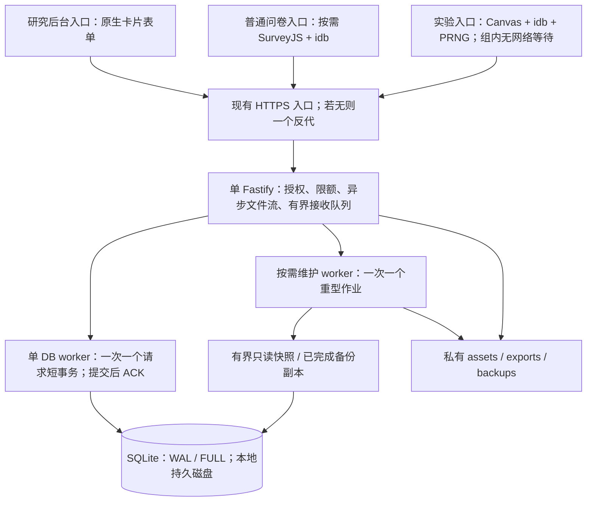

# 轻量化架构与并发稳定性决策

> 2026-10-09 用户最新要求已覆盖本文早期的网页问卷编辑和服务端完整图片解码设计：管理端只用 JSON 文件，图片通过 ZIP 原字节上传、服务器仅做容器／标头校验，真实解码在计时前由客户端完成。方向门禁、逐刻度标签及环境协变量见 [JSON 问卷与图片包](JSON问卷与图片包.md)。早期方案留作历史记录。
版本：2.3；日期：2026-10-08（Asia/Shanghai）。状态：架构讨论和工程减负已完成；首版 P0–P6 业务代码已落实，详见 [实施与验收](P1-P6实施与验收.md)。正式主机、真实设备与独立恢复仍需外部环境验收。

本文根据当前仓库与用户“小型单机、足够轻量、并发稳定”的要求，经四轮 Gemini_bridge 讨论后形成。它优先覆盖主设计的运行架构与性能实现选择；[SQLite 实施修订](SQLite实施修订.md)继续规定数据库、导出和联合备份语义；主设计第 18 节的数据、时序和生命周期合同继续适用。讨论原文是评审输入，采用结论以本文为准。

## 1. 推荐方案与边界

保留 **Node 24 + Fastify + SQLite WAL/FULL**。正式业务采用一个 HTTP 主线程、一个常驻数据库写 worker、一次一个按需维护作业。浏览器将研究后台、普通问卷、Canvas 运行器分为独立入口；普通问卷暂保留 SurveyJS，实验运行页使用原生 Canvas、idb 和固定版本 PRNG。私有图片、导出和备份保存在本地受控目录。

减少成本的重点是下载与解码峰值、同步数据库工作、无界排队、长快照和后台作业争用。库数量、磁盘安装体积、浏览器载荷、进程内存和并发能力分别测量，不能互相代替。

最新需求改为一台小规格服务器同时 1–2 例，其余进入整例 FIFO 等待；原阿里云 2c4g 正在评估降至 1c2g，公网带宽 1Mbps。20 名参加者可作为集中到达测试人数，已不要求 20 例同时采集。已有业务接收/封存及排队实现、本机测量，目标环境容量仍待验收。研究列表、卡片编辑、条件表、版本冻结、数据质量详情及 CSV 仍是首版范围。当前准入配置以 [会话排队与小规格部署](会话排队与小规格部署.md) 为准，本文历史 20 人压力计划据此调整。



图中单 DB worker 与有界队列已在 P0 实现，检查页之外新增 TEST_ONLY 可靠问卷入口。维护作业、研究后台、图片预加载、Canvas 运行器及动态重放现已实现；所有 HTTP 数据库操作均经 worker。worker 移走同步调用，不增加磁盘吞吐，也不消除 CPU、内存和 I/O 争用。

## 2. 逐模块取舍

| 模块 | 首版选择 | 减负理由与暂不采用方案 | 本次状态 |
| --- | --- | --- | --- |
| 1. 普通问卷与分支 | 保留 SurveyJS Library；问卷独立入口；只开放既定题型和受限条件表达式 | 先消除所有页面无条件加载。自研有限 DOM 渲染器虽有减小载荷的可能，但需重做校验、分页、分支、恢复、键盘和可访问性；当前不换 | 普通问卷业务独立入口、受限分支/恢复/封存已实现 |
| 2. 研究后台与卡片编辑 | 独立研究入口，TypeScript、原生表单/DOM/CSS；轻量字段卡片 | 无 React/Vue、商业 Creator、通用拖拽流程设计器；表格和卡片足够表达当前协议 | 原生卡片后台、修订与冻结发布已实现 |
| 3. 图片呈现、输入、补测 | 原生 Canvas + rAF；组前建计划；纯逻辑确定性队列；xoshiro128** 1.1 | 不安装 jsPsych/lab.js 作为运行框架；避免计时路径解析配置、改 DOM、联网和重计算 | Canvas/input/K=0/1/2 动态运行器、黄金向量和服务端重放已实现 |
| 4. 图片预加载与解码 | 静态 PNG/JPEG/WebP；组前有界下载/解码；按摘要内存复用；全部本组所需资源就绪才放行 | 避免全研究一次加载、无界 Promise.all、计时中懒加载和实时转码；预算按像素与目标设备测量 | 组前摘要/尺寸/解码/刷新/存储/几何门控已实现 |
| 5. 本地事件与 outbox | 保留 idb；事件与发件箱一个事务；一次编码的精确字节；有界增量写 | 省去原生 IDB 事务封装重写与首版客户端存储 worker；不把日志压成只有汇总统计 | TEST_ONLY 事件/outbox/提交意图原子存储及中止回归已通过 |
| 6. HTTP、静态服务与日志 | 保留 Fastify/@fastify/static；公共文件构建时预压缩；流式私有响应；关键审计进 DB | 暂不换 Hono/node:http；替换框架不能解决 fsync、图片内存和长作业。减少逐请求日志及运行时压缩 | 公共 gzip/Brotli、缓存规则、敏感字段脱敏和 HTTP 失败日志已落实 |
| 7. SQLite 与接收队列 | better-sqlite3；单 DB writer worker；WAL/FULL；单请求短事务；按数量和字节有界排队 | 不引入 PG、ORM、Redis、消息服务、cluster；不默认跨请求 Group Commit，不改 NORMAL 换吞吐 | SQLite 连接及 pragma 回读检查完成；TEST_ONLY writer/backpressure 已实施 |
| 8. 协议、状态和查询投影 | 同仓库共享字段/状态字典、显式小状态机；原始证据与可重建投影分开 | 避免大型状态机框架、每次读取全量重放、多份手写 schema；可靠性状态不能删 | 共享研究协议、处置历史/精确封存和可重建派生代已实现 |
| 9. 文件发布、网关、清理 | 私有三区；流式授权；同卷排他硬链接发布；显式维护删除 | 无 S3 服务/SDK；无公开静态映射；无定时物理 GC；不自研完整图像 codec | 排他发布、授权文件流、引用/pin 守卫和显式删除已实现 |
| 10. 导出、备份与作业 | 一个受限维护作业；导出短只读视图有界物化；联合备份使用 Online Backup + 持久 pin | 不加任务队列服务；不每次导出先复制全库；不在 HTTP 同步导出、一次把全表装进内存 | 单视图 CSV、实际资产/运行器联合备份与关闭 gate 恢复已实现；独立目标待验收 |
| 11. 认证与接入限制 | 单管理员密码；安全 Cookie、不透明会话凭据、Origin/CSRF、管理员鉴权；全局及 session 限额 | 无团队/复杂 RBAC/OAuth/JWT/PKI；不按校园 NAT 的一个 IP 封死所有参加者 | scrypt 单密码认证、Cookie/Origin/CSRF 和有界限流已实现 |
| 12. 部署与 HTTPS | 单应用进程；已有 HTTPS 则复用，无则一个反代；回环 TCP；系统服务管理 | 不默认 Docker/K8s/PM2/多实例/UDS；初期由 Fastify 服务公共文件，压力需要时再交已有反代 | 同源生产构建入口通过；正式主机/TLS/守护/独立备份待配置 |
| 13. 构建、依赖、测试、源码 | Vite/TS/tsx/Playwright 仅构建与开发；已编译服务 + 网页产物部署；固定源码仅供参考 | 生产服务直接依赖为 4 个（图片完整解码增加 sharp）；SurveyJS/idb 归构建依赖，仍随网页使用；不部署参考 checkout 和浏览器测试工具 | 依赖分类、锁文件、预压缩、检查与基础测量已落实 |

### 2.1 问卷与后台：降低加载成本，保留业务范围

首版继续支持说明、单选、多选、量表、短文本、分页及有限分支。编辑器只生成项目自己的受限协议，再映射给 SurveyJS；配置入口和服务端同时拒绝未知题型/表达式，不让问卷 JSON 成为任意 HTML/脚本入口。不能把“限制复杂度”表述成已经证实 SurveyJS 存在任意 JS 注入。

提交页的答案、实际分支路径和证据由本项目协议保存及封存，SurveyJS 的自动保存不充当可靠采集。隐藏题的 UI 值处理不能删除已接收的历史原始记录；未知路径不能直接标为 skipped。

发布冻结协议、运行器身份、条件表、资源清单及字典；草稿修改另建版本。研究列表、质量状态、问题标记和分页查询照常实现，减少实时仪表盘和全表反复扫描。使用已有 CSS 与原生控件，不为后台添加框架。

独立文档入口可隔离代码依赖，不能保证 GC 立即完成或浏览器进程内存归零。页面切换只能发生在问卷/组间的已确认边界；服务端确认相应封存和进度后再切换，不携带 Token 到 URL。新文档建立 clock_epoch，准备完成后才取得组许可，不在时序组内导航或恢复重做。

### 2.2 时序、输入和本地写入：将工作移到准备阶段

组前冻结布局、条件时长、资源身份、输入归属和完整可执行计划；组内保持固定图片/空屏节奏。预分配有界缓冲，减少对象分配和 DOM 改动；不能保证浏览器“零 GC”。

分别记录 rAF 时间、绘制调用参考时间和输入观察时间；draw-call 完成是软件参考，不是光子曝光。保留原始数值精度、阶段事件及诊断，不将 Float64 时间擅自量化成整数微秒，不用均值/抖动汇总替代原始证据。longtask 等接口仅在支持矩阵允许时辅助诊断。

事件 ID 与摘要分别生成。原始 envelope 包含身份、schema、实例/位置及载荷；UTF-8 编码一次后复用原字节，SHA-256 是摘要。服务端核验传来的精确字节，不排序/重编码后替代 raw。是否使用固定序列化格式由 P0 字典定义；不额外要求所有重试重算“规范 JSON”。

event_records/outbox 同一 IDB 事务，等待 tx.done。未来的队列插入、取消和开始意图必须在规定截止点前完成持久化；实际 onset/输入不可能在发生前存储。对这些已发生事实增量保存，不延长刺激/ISI 来等事务。截止点无法满足即按合同终止，不能偷偷等待或补填空试次。

本地 custody ACK 与最终封存分层。匹配 ACK 只证明数据库接管，不能立即删除唯一 raw；匹配 seal 或终止对账完成后按保留规则清理。

第二标签页只读。明确的未知状态恢复关闭旧 permit、终止该会话，不开启同一会话的新执行；历史合法数据仍可补传接管。计时期间切后台、超预算卡顿/写失败导致不可逆 TERMINATED；组前加载或解码故障则阻断、受控重试/退出。

默认每根 K=2，100 个根试次最坏 300 个实例；不因补测失败重置次数。补测仅在安全未执行后缀随机插入，软间隔不足可安全尾插，所有位置、次数和 PRNG 消费可重放。STAGED 不能冒充已经呈现；出现前迟到纠正且无安全撤销按既定要求终止，出现后保留已执行固定阶段。

### 2.3 图片：像素与同时驻留量是首要预算

压缩文件 500KB 不能推导解码内存。width × height × 4 只是一个像素面下界，实际还包括解码中间态、图片对象、Canvas、GPU/浏览器拷贝。限制每图像素、每组唯一图片数、同时下载/解码数量和总驻留预算；具体数值在目标手机上测试后冻结。Gemini 提到的“并发 4”只能作为 TEST_ONLY 探索起点。

当前组可能执行的原始及补测资源全部在组前完成下载、真实摘要、格式和解码门控；按资源 hash 去重复用。组内不进行下载、解码或 Canvas 尺寸重置。前后组的释放/复用只能在安全边界完成；不能以懒加载省内存破坏组执行许可。

若整组/全任务连续模式超预算，发布/准备阶段拒绝不合规计划，或者由研究者显式调整协议与分组；不能静默缩图或改模式。图片尺寸/质量转换会产生新字节、新 hash 和新资源版本，须预先审核固定。网页服务不实时转换刺激。

上传期做有界长度、格式/静态性、像素头检查，再由成熟库执行完整解码校验并缓存校验版本。仅 magic/chunk 扫描不足以证明完整解码。具体库在 P3 小规模对比后固定；考虑解码内存上界、畸形数据与超时，worker 不是安全沙箱，也不能保证 native OOM 不影响整个进程。

私有刺激默认 private, no-store, no-transform，经同源授权流式返回，组前在内存复用。Cache API 不能清理浏览器 HTTP 磁盘缓存；不宣称浏览器退出即可可靠擦除它。公共 hash JS/CSS 才使用 immutable。

### 2.4 接收、SQLite 和背压：短事务、单在途、明确未知

HTTP 先执行认证、体积/schema 的有界检查；队列同时限制待处理数、字节及每请求工作量。跟踪在途与暂存内存，包含解析/克隆的实测成本。主线程一次只向 DB worker 发送一个 RPC，避免 MessagePort 背后成为第二个无界队列。

writer 对单个请求使用短 BEGIN IMMEDIATE。事务内再次核验 writer fence、permit、接入/会话状态、唯一身份与分配规则，防止排队期间状态变化。合法历史 raw 与推进当前状态分开处理；禁止因旧 epoch 一律丢弃历史数据。原始 bytes、接收凭证、冲突记录、disposition 和必要投影保持同一请求的原子语义，COMMIT 成功后才能 ACK。

超队列上限/服务临时不可用返回 503 和受控重试信息；明确的频次限额可用 429。未发送到 writer 的请求可确认为 NOT_INGESTED；已经发送但超时/失联只可返回 UNKNOWN，不能声称未写。浏览器用原 event_id/hash 查询或补传，服务端不制造新身份。

控制请求可留有界容量并确定公平顺序，避免 bulk 上传占满后无法记录终止；不得无限优先级插队/饿死历史补传。排队即接收不等于持久接管。

worker 超时后暂停接收；terminate() 请求不证明同步 native 调用已退出。确认旧 worker exit 或整个应用停止后才创建替代 writer；否则继续不可用。重启后按数据库凭证消解未决请求，不复活计时会话。采集准入前测试 native 停顿、worker 退出、整进程崩溃与磁盘满。

保留 WAL/FULL/FK，默认 3 秒 busy_timeout 是当前开发配置，不能直接认定正式合适。索引先满足唯一约束、会话/event 查询、清单核对和分页质量视图；用查询计划和压力证据增加索引，不给每个 raw JSON 字段建索引。

不默认周期 TRUNCATE/RESTART，不因“大 WAL”直接删除文件；有界监测 checkpoint/WAL/读视图年龄。PASSIVE 仍有 I/O/锁成本。维护作业与 writer 协调，测量真实 busy 和尾延迟，不在高峰执行长检查。

首版不默认跨请求组提交；一次请求可包含受限事件集合，事务规模须有预算。后续 Group Commit 必须重新定义逐请求校验、回滚/取消、冲突和 ACK 语义，不能只是积攒队列后一次 COMMIT。

### 2.5 文件与维护：保留恢复证据，控制重型任务数量

上传意向先登记，私有完整暂存后验证，同卷排他 fs.link 发布、不覆盖，按平台验证文件/目录 fsync，再完成 DB 登记；文件与 DB 不伪装成跨系统原子事务。每个崩溃窗口可通过意向、对象和登记状态对账。

正文路径只解析受控对象身份，检查授权/冻结清单后流式读取，不把任何私有区映射给 public static；导出与备份下载也须鉴权。临时上传、结果文件及失败任务均有容量上限。

维护删除需 refs/pins 为零并进入 DELETING，成功 unlink 后登记 PURGED；unlink 不能回滚。未决对象、旧 permit、作业 pin 不按时间“自动过期删除”。首版没有物理自动 GC，研究者问题标记不拥有维护删除权。

一次一个重型作业涵盖导出物化/压缩、图像深度校验、联合备份和维护扫描；记录作业身份、阶段、字节/时间预算与恢复状态。线程调度仍竞争 2 核和磁盘，须在采集压力下验证，不宣称隔离即无影响。

CSV 首选专用只读连接 BEGIN + 第一次实际读取建立单视图，在同一视图有界物化所有表/清单，核对后释放读事务，再压缩发布。限制快照时长、WAL 增长、输出和暂存空间。若以后证明全库副本导出更合适才切换，不将 Online Backup 设为所有导出的强制前置。

源会话未完成/终止/证据冲突仍如实导出并标记；导出过程漏项或快照混合不能 READY。数据质量页显示缺失、冲突和诊断的证据边界，不能仅凭行数证明完成。

联合备份严格沿 SQLite 修订：资源生命周期屏障 → Online Backup 完整成功 → 从完成副本读取资源清单 → 源库短事务核验并登记 BACKUP_PIN → 释放屏障 → 复制真实资源到独立目标并核验 → READY。备份不是开始时间快照；未决 pin 通过作业恢复消解，不能超时释放。

### 2.6 认证、运行与依赖

采用标准随机不透明凭据、服务端验证和安全 Cookie；研究者登录凭据与会话 token 分别按合适的安全方式保存。写请求校验 Origin/CSRF，拒绝未知配置和任意脚本；维持研究者/维护者权限边界。限流同时有全局和 session 预算，内存映射有限并回收，不以单 IP 小限额误伤同校园 20 人。

首版单应用单 writer，部署管理保证同一活跃 DB 路径没有第二个应用实例；不要用多核 fork 启动多个独立队列。数据库在本地持久磁盘，反代经回环 TCP；实际 TLS、操作系统、文件系统和独立恢复目标在 P1 固定。

先由 Fastify 服务预压缩公共资产，复用已有反代。压测若显示公共传输占主要资源再移给同一反代，不额外起独立静态应用。私有网关始终由授权服务控制。

构建环境安装完整依赖；部署已经生成的 dist 和 lock，再 npm ci --omit=dev。当前服务端运行直接依赖仅 fastify、@fastify/static、better-sqlite3。idb、SurveyJS 是构建时输入和浏览器运行库，归 devDependencies 不表示浏览器不需要它们。构建产物必须随部署发布；不能在 omit=dev 之后尝试构建网页。生产不复制 references/checkouts、测试浏览器或 var 本地开发数据。

## 3. 可以推迟和不能省略的工作

可以推迟：自研通用问卷引擎、商业拖拽 Creator、多人组织权限、WebSocket 实时仪表盘、PWA/Service Worker 离线站点、S3、ORM、Redis、集群/容器编排、跨请求组提交、客户端存储 worker、服务器自动图片优化以及未经需要的数据库抽象层。

不能省略：不可变 raw 和冲突凭证、custody/disposition/seal、事务后 ACK、本地原子事务与截止点、单写者/permit、可重放 PRNG 与补测上限、运行失败不可重做、冻结版本/分配、资源完整门控、受控发布删除、授权、单快照导出、独立联合备份/恢复及容量准入。

这些合同是“稳定”的主要成本。删掉它们也能得到更小的程序，但无法满足当前科研数据要求。

## 4. 何时重新评估替代方案

| 备选 | 触发证据 | 替换前必须满足 |
| --- | --- | --- |
| 原生有限 DOM 问卷 | 页面隔离/特性限制后，SurveyJS 在目标机型的加载、内存或操作预算仍不合格，且成本集中于其渲染 | 六类题型、分页校验、分支历史、封存/恢复、键盘及可访问性全部等价；对比真实 bundle/内存/交互，不以代码行数估算 |
| node:sqlite | 维护原生依赖/部署成本成为实际问题，固定 Node 所带引擎及 API 经本地核对能满足要求 | WAL/FULL/FK、raw BLOB、事务/锁错、Online Backup、只读视图、崩溃与 worker 行为通过同一套回归；本轮未核定其完整能力，不断言其没有 backup 或已/未稳定 |
| 有界 Group Commit | 目标磁盘 fsync/短事务是主要瓶颈，单请求方案在合理请求规模下持续积压、超预算 | 逐请求身份/冲突/取消、失败隔离、未知提交、提交后 ACK 与控制请求公平性明确，证据表明收益足以抵偿复杂度 |
| 公共静态文件交反代 | 预压缩与缓存后，集中资源传输占满 Node CPU/事件循环/带宽预算 | 同一 public 构建目录、缓存/Vary 正确；私有资源仍授权，不将素材/备份混入公开路径 |
| SQLite 换 PG / 独立维护进程 | 单 writer 或宿主 I/O/CPU 成为持续瓶颈，经过短事务/预算调整仍未满足实际负载；或确需多主机/多应用写入 | 保持原始身份、事务凭证、读视图与联合恢复合同；以故障/压力回归比较，不按某个人数阈值自动迁移 |
| HTTP 框架替换 / 客户端 storage worker | 分析证明框架或前端序列化/存储调用本身是主瓶颈 | 实测收益超过新实现及维护成本，不能牺牲解析限额、错误处理、IDB 原子性及时序截止点 |

上述触发基于研究预算与实际负载，没有采用 Gemini 提供的 30 个请求/2MB 队列、15/20ms fsync、120MB 堆、32MB WAL 或 100 人阈值。它们不是本项目已测准入值。

## 5. 实施顺序与依赖

保持主设计阶段含义。Gemini 第四轮重新编号的 P2 导出、P4A 压测等不作为阶段替代。下面 P4A 指主设计中的 P4 固定任务，P4B 指动态补测。

| 阶段 | 具体工作 | 必须先有的依赖与验收 |
| --- | --- | --- |
| P0：协议与最小可靠采集 | 共享数据字典、稳定身份/原始 envelope、IDB 双表、精确接管/封存、冲突证据；writer/permit 状态；有界 DB worker/RPC；确定性队列及 TS PRNG | TEST_ONLY 问卷和故障钩子；断网/丢 ACK/乱序/同 ID 异 hash、过期 writer 历史补传、第二 tab、未发送与未知提交、worker 重启、截止点及黄金向量通过 |
| P1：自托管基础 | 正式 HTTPS/单实例服务、三私有区、受控发布/删除原语、维护作业框架、联合备份/独立恢复、基本认证 | P0 接收/身份基础；本机可先做文件原语；真实 OS/文件系统崩溃窗口、权限、持久 pin/屏障及联合恢复通过。没有恢复备份就不开放正式采集 |
| P2：问卷编辑与冻结版本 | 研究后台/问卷独立入口；有限题型/条件 AST；卡片/条件表；分页提交/路径/封存；版本字典；最小质量查询与全状态导出 | P0 数据/封存 + P1 授权与文件；问卷入口与 runner 依赖无泄漏；隐藏字段历史、锁页、丢 ACK、冻结协议、单视图导出无遗漏通过 |
| P3：图片门控 | 上传限制/成熟解码器、私有授权网关、hash/清单/像素预算、下载解码队列和准备页 | P1 发布/权限 + P2 冻结资源清单；损坏/动画/超像素/下载中断均不能放行；准备故障可恢复；目标设备冷/暖准备和同时驻留预算通过 |
| P4A：固定时间线与分配 | 独立 Canvas 入口；固定时长/ISI；单图片/固定按钮；输入归属/软件时间；服务端分配一次；终止/补传 | P0 持久截止点和单写者 + P3 全资源门控；计时中无网络等待/依赖加载，保存开启后假时钟/故障及设备诊断符合合同 |
| P4B：有界动态补测 | 根/实例/cap、安全后缀插入/间隔、PRNG 消费、队列意图及截止点、迟到纠偏、动态核对/导出 | P4A + P0 重放与身份；K=2 最坏 300 实例、短/零 ISI、STAGED/onset 两侧纠偏、写延迟、尾部预算、禁止重做全部通过 |
| P5A / P6：容量与运维准入 | 最多单例/双例活动、其余等待的集中到达压力、真机/内置浏览器、质量详情完善、监测/备份频率/保留/恢复手册 | 全业务合同；目标主机/网络/素材及设备预算，故障矩阵、独立恢复、版本/数据质量证据齐全后开放相应研究采集 |

可以并行做独立准备工作；不以“上一阶段全部做完才允许写任何后续代码”机械限制研发。前置验收限制的是相关功能放行和正式采集。

**开工阻塞：没有需要用户重新选择技术栈的阻塞，可按 P0 实施。** 精确字典、writer 故障处理、入口依赖断言是要完成的 P0/P2 任务，不是假装已通过的准入。具体实验数值、正式服务器和设备尚未固定时，可用标为 TEST_ONLY 的夹具推进；不能据此开放正式数据。

## 6. 并发与稳定性验收计划

先固定代表性条件表、图片像素/字节/唯一数、组长、时长/ISI、补测 cap、事件尺寸和提交节奏。计时组内不传数据意味着上传可能在组边界集中出现；HTTP 平均 QPS 不能描述这种峰值。

| 场景 | 负载/故障 | 观测与通过依据 |
| --- | --- | --- |
| 普通采集 | 1/5/10/20 个独立会话集中到达，活动上限分别测试 1/2；同 NAT | 活动名额上限、FIFO 等待与刷新/回收、ACK p50/p95/p99、队列数/字节/等待、503/429、事务/FULL 延迟、CPU/RSS、事件循环、无不应发生的限流 |
| 集中预加载 | 冷缓存、会话排队后至多两例进入准备；目标真实图片/像素；单图片流 | 服务带宽/文件描述符、准备耗时、手机内存/解码峰值、全部门控；组内不存在缺图或下载 |
| 峰值上传与乱序 | 组间同步、离线积压补传、重试风暴、ACK 丢失/重复/异 hash | 队列始终有界；NOT_INGESTED/UNKNOWN 可区分；同身份重试精确凭证/当前处置；不虚假 ACK |
| 最坏补测 | 默认 K=2；100 根 → 至多 300 实例；短/零 ISI和迟到输入 | 可重放队列/PRNG、截止点、上限、资源预算、STAGED/onset 边界、不可逆终止和完整原始证据 |
| 采集叠加维护 | 分别叠加导出、图片校验、备份；一次一个重型作业 | writer 尾延迟、busy、快照时间/WAL 增长、暂存/磁盘限额；超预算显式失败，采集完整性保持 |
| 故障与重启 | 杀 worker/进程、native 停顿、存储满/慢、断网；真正断电另测 | 无双 writer/虚假成功；未决请求可对账，原始 bytes/冲突保留；历史补传，计时会话不复活 |
| 浏览器真机 | 目标 Android/iOS、微信宿主、高低刷新率；隐藏/旋转/持续触摸/多点/配额 | 支持矩阵与可观察软件预算、输入归属/布局/终止合同；无法保证不可观察崩溃事件必然记录 |
| 独立联合恢复 | DB + 资产 + 协议/runner/字典/配置，从独立目标重建 | 对象真实字节/摘要/引用与恢复视图一致；处置未决屏障/pin/permit；满足选定 RPO/RTO |

所有延迟、字节/像素、队列、读视图和磁盘阈值写入环境档案，采用实际测量和研究预算；不将 Gemini 的估算当验收值。每个规模应覆盖完整任务及持续混合负载，记录失败原因和排除规则，而非只跑一秒健康检查。正式首版只报告软件时序，物理呈现精度仍需要外部测量。

## 7. 本次已实施与实测范围

已做：

1. SurveyJS 及其 CSS 从检查页入口移为显式按需加载，附失败重试；浏览器测试确认点击前没有问卷 chunk 请求。
2. 构建时生成公共 JS/CSS 的 gzip/Brotli 文件，Fastify 直接发送预压缩版本；hash 资产 immutable，HTML no-cache，API no-store。
3. 关闭默认逐请求日志，保留 HTTP 失败结构化日志和启动/应用日志，脱敏认证 Cookie；业务审计仍须在 P0/P1 单独实现。
4. 回读验证 SQLite WAL/FULL/FK/busy 设置；未改变 FULL。
5. SurveyJS/idb 归构建依赖；生产服务端运行依赖从 6 个直接包降至 3 个，不新增依赖。新增 foundation 测量脚本与构建 manifest。
6. 更新设计优先级，保存 Gemini 每轮完整输入/输出与基础测量原件。

本机 macOS arm64 / Node 24.21.0，按相同 Node gzipSync 方法测量的**初始检查页 JS/CSS**：

| 项目 | 减负前 | 减负后 |
| --- | ---: | ---: |
| 初始 JavaScript | 1,684,026 bytes | 7,348 bytes |
| 初始 CSS | 519,908 bytes | 753 bytes |
| 初始 JS + CSS | 2,203,934 bytes | 8,101 bytes |
| 初始 JS + CSS gzip 估算 | 431,289 bytes | 3,718 bytes |

初始未压缩载荷约降 99.63%。减负后按需问卷 chunk 仍为 JS 1,678,576 bytes、CSS 519,371 bytes；全部 JS/CSS 总计 2,206,048 bytes。变化是加载时机与路径隔离，不能声称总库体积、问卷阶段内存或真实计时稳定性已经达标。预压缩文件与上述默认 gzipSync 估算的压缩参数可能不同；原始尺寸与网络行为分别验证。

`npm run check` 通过：TypeScript、生产构建、SQLite 基础夹具、3 项 Chromium 测试。夹具覆盖 WAL/FULL、精确 bytes、唯一约束、事务回滚、稳定读视图及 Online Backup 重开文件；浏览器覆盖按需问卷/IDB/Canvas、私有路径不可公开访问、Brotli/Vary 与缓存规则。

`npm run doctor` 通过环境、8 个参考提交/许可证及 PRNG 摘要。foundation 仅在本机循环 10 波、每波 20 个**只读 readiness GET**：前后各 200 请求、0 失败；没有参加者事件写入、图片预加载或重型作业。前后 p99 分别 13.02ms/11.56ms，样本过小且场景不同于采集，不据此推断吞吐提升。原件见[减负前](gemini轻量化讨论/foundation-before.json)与[减负后](gemini轻量化讨论/foundation-after.json)。

另建隔离发布目录执行 `npm ci --omit=dev --offline`，安装 71 个包（含传递依赖），确认没有 Vite/tsx/TypeScript/Playwright/SurveyJS/idb 的本地 npm 安装目录；已构建服务正常加载 SQLite、返回健康检查和网页/Brotli 文件。此测试使用本机原生平台与现有私有目录，不代表 Linux 发行或正式业务部署。原件见[production-probe.json](gemini轻量化讨论/production-probe.json)。

可复测：
```sh
nvm use
npm run check
npm run profile:foundation -- .local/foundation-after.json
npm run doctor
```

## 8. 讨论取舍与追踪

[Gemini 会话](https://gemini.google.com/app/bd5579d16e322d7a)完成四轮：全模块筛查；DB worker/事务/导出专项；前端隔离/图片/IDB专项；全栈最终收敛。完整记录见[讨论索引](gemini轻量化讨论/README.md)。

采纳：按需加载/独立入口、有界准备、有界接收、单 writer、短事务、维护作业互斥、预压缩/生产依赖分类和测量驱动替换。

纠正或拒绝：

- “切页保证清空 Heap”“固定数组零 GC”“worker 零阻塞”“decode 保证 GPU 就绪”“备份无锁/无竞争”均不能作为保证。
- SHA256 不作为签名或 event_id；ID 不额外要求全局单调；历史原始 bytes 不用排序 JSON 重编码覆盖。
- ACK 不等于 seal；第二 tab 不自动终止；旧 epoch 不一律拒绝 raw；时间不自动释放许可/pin；unlink 不能回滚。
- onset/input 不能在事实发生前落盘；不为保存拉长刺激/ISI；组前准备故障与计时中故障分开。
- 不能仅检查图片头就断言完整有效，也不为零依赖重写 codec；不能靠 Cache API 擦除 HTTP 缓存。
- 第四轮仍把全部导出绑定全库 backup，并给出任意队列/性能数字和绝对拦截率；采用本文受限读视图与实测准入，不采用这些表述。
- node:sqlite 的完整 API/稳定性未在本轮核定，不采纳“没有 backup/因此不能用”的断言。
- Gemini 的文档入口/性能估算没有逐条独立复核；讨论原文不是生产性能证据。项目结论以本地已测代码及正式验收为准。

## 当前实施补充

代码与本机软件验收见 [P1–P6 报告](P1-P6实施与验收.md)，实际 1/5/10/20 混合 HTTP 原件见 [测量 JSON](混合采集本机测量.json)。用户后续确定目标为阿里云 2 核/4GB、Ubuntu 26.04、系统盘 2120 IOPS / 106.0 MB/s 和 1Mbps；本机 M4/16GB 结果不充当该主机或真实手机/内置浏览器准入。维护单作业会对同步封存产生可重试 503，测试使用有界退避；原始本地事件在确认前保留。实际任务预算和等待窗口仍需正式环境登记。

1Mbps 下的当前准备策略为组前全局 FIFO、最多 64 个票据、默认单会话单流及串行下载/解码；不是早期探索的并发 4。原字节/hash/解码门控、组内零准备网络活动、WAL/FULL 和原始合同保留。新发行物以 canonical 能力声明固定图片 GET 的票据要求，旧冻结代码继续原请求并共享 FIFO 容量。部署参数、预算、升级限制及限速测量边界见 [阿里云 1Mbps 部署与验证](阿里云1Mbps部署与验证.md)，原 Gemini 四轮补充见 [讨论索引](gemini轻量化讨论/README.md)。

随后按用户要求增加整例准入：`SESSION_CONCURRENCY=2` 默认双例、支持 1；全局持久 FIFO 最多 64 个活动/等待条目，问卷到最终封存全程占位。无 ISSUED 的失联 5 分钟回收，未关闭许可持续占位；计时组前停止全部轮询。1c2g 可选配置、本机单例/双例和 1Mbps 报告见 [会话排队与小规格部署](会话排队与小规格部署.md)，目标环境仍待验收。
